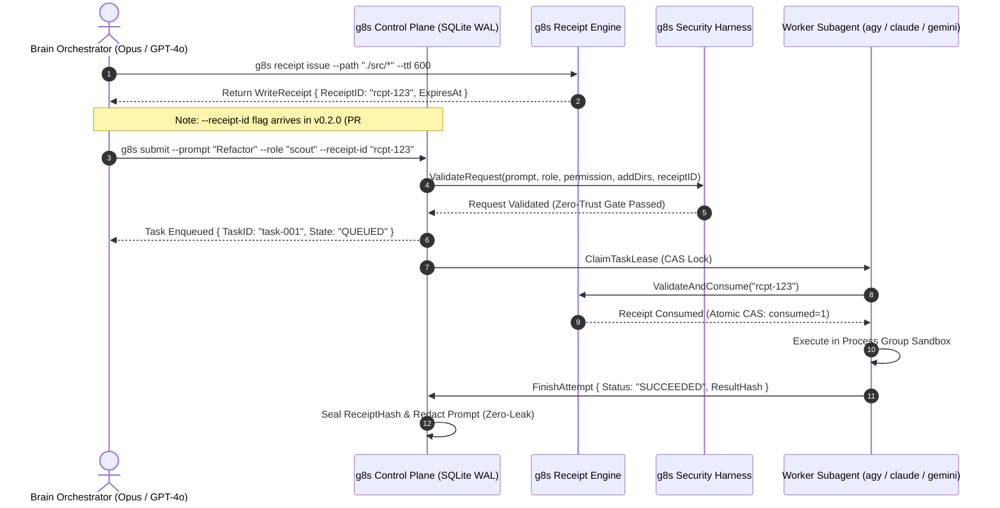
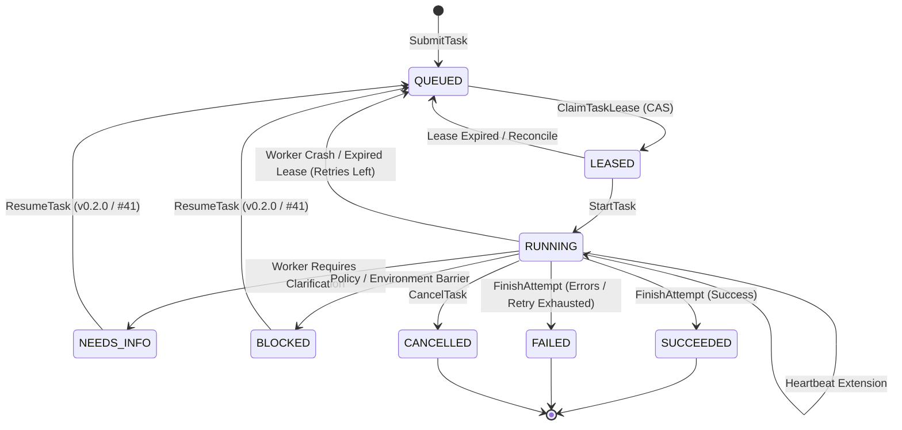

# g8s System Architecture & The 3-Plane Separation Standard

> **Architectural Standard**: The 3-Plane Separation of Concerns (Infrastructure ⟷ Design Language ⟷ Runtime)  
> **Target Audience**: Systems Engineers, Security Architects, Framework Contributors  

---

## 1. The 3-Plane Architectural Separation

To prevent tight coupling and eliminate architectural fragility, `g8s` is strictly partitioned into **3 Orthogonal Planes**:

```
┌─────────────────────────────────────────────────────────────────────────────────────────┐
│                      PLANE 1: DESIGN LANGUAGE & SPECIFICATION PLANE                     │
│                               (DESIGN LANGUAGE PLANE)                                   │
│                                                                                         │
│  • Spec Kit Constitution (`spec/constitution.md`) — Foundational Laws                   │
│  • OpenSpec Delta Specifications (`spec/openspec/*.md`) — Incremental Contracts         │
│  • Role Contracts (`collector`, `scout`, `verifier`...) & Permission Profiles           │
│  • Write Receipt Schemas (`receipt-v1.schema.json`) & Task Schemas                     │
│                                                                                         │
│  👉 Role: Pure Intent, Human/AI Readable, Versioned Declarations, Zero Runtime Lock-in  │
└────────────────────────────────────────────┬────────────────────────────────────────────┘
                                             │
                                  Interpreted & Enforced By
                                             │
┌────────────────────────────────────────────▼────────────────────────────────────────────┐
│                              PLANE 2: RUNTIME ENGINE PLANE                              │
│                                  (RUNTIME ENGINE PLANE)                                 │
│                                                                                         │
│  • Harness Engine: Request validator & Contract Prompt Builder (`internal/harness`)     │
│  • ControlPlane: Pure-Go SQLite WAL Queue & Atomic CAS Leases (`internal/controlplane`) │
│  • Capability Manager: Single-use Write Receipt & TTL Validator (`internal/receipt`)    │
│  • Process Supervisor: Process Group Cages (`Setpgid`) & Stream Redactor                │
│  • Stdio MCP Server: Standard JSON-RPC 2.0 interface (`internal/mcp`)                   │
│  • Blast Radius Engine: LSP Client & Dependency Analyzer (`internal/analyzer`)          │
│                                                                                         │
│  👉 Role: The Pure-Go Kernel (15MB Static Binary), Stateless Execution, Zero CGO        │
└────────────────────────────────────────────┬────────────────────────────────────────────┘
                                             │
                                      Drives & Isolates
                                             │
┌────────────────────────────────────────────▼────────────────────────────────────────────┐
│                             PLANE 3: INFRASTRUCTURE PLANE                               │
│                            (PHYSICAL INFRASTRUCTURE PLANE)                             │
│                                                                                         │
│  • Worker Executables: Installed CLIs (`agy`, `claude`, `gemini`)                       │
│  • Local Hardware & GPU Backends: `ollama` (VRAM), Local LLM endpoints                 │
│  • Operating System Services: macOS `launchd`, Linux `systemd`, Windows Service         │
│  • OS Security Boundaries: Process Groups, File Descriptors, POSIX `0600`/`0700`        │
│  • Persistent State Store: `$XDG_STATE_HOME/g8s/` (`control-plane.sqlite3`)             │
│                                                                                         │
│  👉 Role: Raw Compute, System Daemons, Hardware Resources, Physical Sandboxes           │
└─────────────────────────────────────────────────────────────────────────────────────────┘
```

---

## 2. Invariant Rules Across the 3 Planes

1. **Plane 1 (Design Language) NEVER imports Plane 2 or Plane 3**:
   - Specifications, roles, and schemas are pure data formats (Markdown, JSON Schema, YAML). They can be read and verified independently by any external system or human auditor without compiling the Go binary.

2. **Plane 2 (Runtime) is Stateless & Agnostic to Specific Models**:
   - The Go engine does not care whether a worker is powered by Gemini Flash, Claude Haiku, or a local Llama model. It only enforces the contract envelope defined in Plane 1 and coordinates the process in Plane 3.

3. **Plane 3 (Infrastructure) is Completely Replaceable**:
   - Upgrading from macOS `launchd` to Linux `systemd`, or replacing `agy` with `claude-code`, requires zero modifications to Plane 1 contracts or Plane 2 core scheduling logic.

---

## 3. Package Structure Alignment

```text
g8s/
├── spec/                             # [PLANE 1: DESIGN LANGUAGE]
│   ├── constitution.md               # Spec Kit Project Constitution
│   └── openspec/                     # OpenSpec Delta Specifications
│
├── internal/                         # [PLANE 2: RUNTIME ENGINE]
│   ├── harness/                      # Role & Permission contract enforcement
│   ├── controlplane/                 # Pure-Go SQLite WAL task state machine
│   ├── receipt/                      # Capability delegation & single-use verification
│   ├── worker/                       # Process group lifecycle & stream sanitization
│   ├── analyzer/                     # LSP Blast radius intelligence
│   └── mcp/                          # Stdio JSON-RPC 2.0 MCP server
│
├── cmd/g8s/                          # CLI Entrypoint uniting the planes
│
└── reference/python/                 # Historical parity baseline
```

---

## 4. Visual Workflow & State Machine

### A. Two-Tier Zero-Trust Capability Flow



### B. Task Lifecycle Finite State Machine (8 States)


