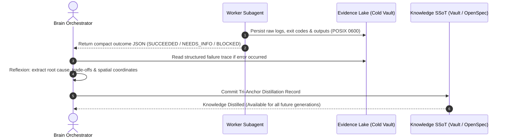

# Contextual Knowledge Distillation & Tri-Anchor Specification

> **Standard Specification**: The Tri-Anchor Contextual Knowledge Distillation Protocol  
> **Theoretical Foundations**: Reflexion (Shinn et al., NeurIPS 2023), Least Privilege in Information Systems (Saltzer & Schroeder, 1975), Memory Compaction (Sumers et al., 2023).

---

## 1. Executive Summary & Purpose

A core failure mode of autonomous multi-agent systems is **un-anchored knowledge distillation**:
* **Over-abstracted distillation** (stripping all context) produces generic, useless rules like *"always validate inputs"*.
* **Over-contextualized distillation** (retaining entire execution and chat traces) re-introduces context bloat, leading to *"Lost in the Middle"* attention degradation and quadratic token cost.

`g8s` enforces **The Tri-Anchor Contextual Distillation Protocol**: every lesson, technical decision, and security mitigation extracted into Single Source of Truth (SSoT) specifications MUST preserve exactly **Three Structural Anchors**.

```
┌─────────────────────────────────────────────────────────────────────────────────────────────┐
│                          THE TRI-ANCHOR CONTEXTUAL FRAMEWORK                                │
├───────────────────────────────┬───────────────────────────────┬─────────────────────────────┤
│ 1. CAUSALITY & INTENT ANCHOR  │ 2. SPATIAL & CODE ANCHOR      │ 3. FORENSIC & TEST ANCHOR   │
│ • "Why was this done?"        │ • "Where does this apply?"    │ • "How is it verified?"     │
│ • Root cause of the failure   │ • Target package, file & func │ • Deterministic test case   │
│ • Explicit trade-off ledger   │ • Exact boundary invariants   │ • Sealed SHA-256 hash       │
└───────────────────────────────┴───────────────────────────────┴─────────────────────────────┘
```

---

## 2. The 3 Contextual Anchors

### Anchor 1: Causality & Intent Anchor
Defines the historical problem statement, failure trigger, and architectural trade-offs:
* **Failure Trigger**: The exact boundary condition or exploit payload that failed.
* **Architectural Trade-Off**: The deliberate trade-off made (e.g. favoring Pure-Go isolation over native CGO performance).

### Anchor 2: Spatial & Code Coordinates Anchor
Defines the physical boundaries where the knowledge applies:
* **Target Coordinates**: Package name (`internal/harness`), file path (`harness.go`), and symbol identifier (`resolveExistingSymlinks`).
* **Scope Constraints**: Role taxonomy (`collector`, `scout`), permission level (`read_only`, `workspace_write`), and filesystem path fragments (`DeniedPathFragments`).

### Anchor 3: Forensic & Verification Anchor
Defines cryptographic and test evidence proving ground truth:
* **Verification Test**: The exact Go unit/race test asserting correctness (`TestValidateRequestRejectsNestedNonExistentChildInSymlink`).
* **Cryptographic Evidence**: SHA-256 `ReceiptHash` sealed in SQLite and Evidence Lake artifacts.

---

## 3. Standard Schema for Distilled SSoT Artifacts

When distilling lessons into `spec/openspec/` or the Pure-Go Knowledge Vault (`internal/vault`), the record MUST follow this structured schema:

```yaml
distillation_record:
  id: "DELTA-01-AMENDMENT-A"
  title: "Ancestor Directory Traversal for Symlink Path Gating"
  milestone: "v0.1.1"
  status: "APPLIED"

  # Anchor 1: Causality & Intent
  causality:
    problem: "filepath.EvalSymlinks fails on non-existent leaf targets, allowing attackers to reference files under symlinked sensitive directories."
    trade_off: "Walk parent directories iteratively up to root rather than following symlinks recursively to eliminate infinite loop risks."

  # Anchor 2: Spatial & Code Coordinates
  spatial_coordinates:
    package: "internal/harness"
    file: "internal/harness/harness.go"
    symbol: "resolveExistingSymlinks(path string) string"
    denied_fragments: ["/.ssh", "/.env", "/.aws", "/.gnupg"]

  # Anchor 3: Forensic & Verification
  forensic_verification:
    test_file: "internal/harness/harness_test.go"
    test_case: "TestValidateRequestRejectsNestedNonExistentChildInSymlink"
    exit_criteria: "CGO_ENABLED=0 go test -v -race ./internal/harness/... PASS 100%"
```

---

## 4. The 4-Stage Reflexion & Distillation Cycle



---

## 5. Architectural Guarantees

1. **Context Density**: Distilled records consume $<200$ tokens in prompt injections while providing 100% actionable precision.
2. **Generational Transfer**: Next-generation agents inherit distilled records via `manifest.json` and `g8s vault query` without reading thousands of historical conversation logs.
3. **Anti-Fragility**: Every production failure permanently strengthens the system's test suite and specification contracts.
