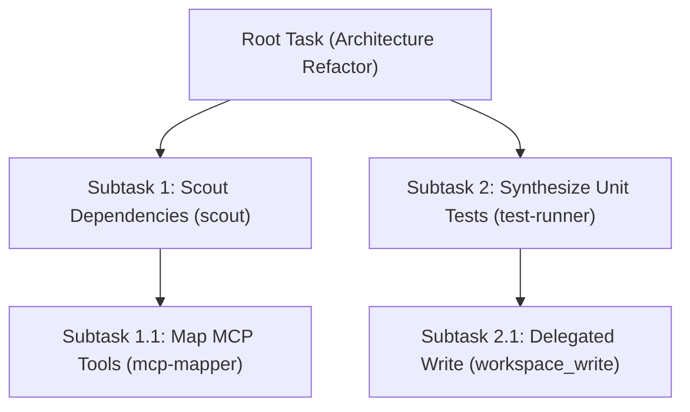

# Decoupled Memory & Cognitive Architecture in g8s

> **Whitepaper & Technical Specification**: Decoupling Memory from Autonomous AI Agent Execution  
> **Theoretical Foundations**: MemGPT (Packer et al., 2023), CoALA (Sumers et al., 2023), Generative Agents (Park et al., 2023), Attention Degradation in Long Contexts (Liu et al., 2023).

---

## 1. Executive Summary & Problem Formulation

Traditional multi-agent architectures treat the LLM's **Context Window** as a monolith that simultaneously holds conversation history, reasoning scratchpads, tool execution logs, codebase files, and long-term memory. This paradigm leads to three critical system failures:

1. **"Lost in the Middle" Degradation**: As in-context token volume expands ($>30,000$ tokens), LLM attention density degrades exponentially. Subagents begin to ignore system boundaries, overlook forbidden action lists, and hallucinate code structures.
2. **Compounded Error Propagation (Hallucination Cascade)**: When transient, erroneous subagent reasoning remains pinned in shared context, downstream agents inherit and amplify those false premises.
3. **Quadratic Cost & Latency ($O(N^2)$ Attention)**: Resending vast chat and execution histories on every tool call increases latency and token consumption without improving reasoning quality.

### The g8s Axiom: The OS-Style Virtual Memory Hierarchy

`g8s` resolves these failures by **completely decoupling memory from the agent execution core**:

```
┌─────────────────────────────────────────────────────────────────────────────────────────────┐
│                           g8s DECOUPLED MEMORY ARCHITECTURE                                 │
├─────────────────────────────────────────────────────────────────────────────────────────────┤
│  AI AGENT CONTEXT WINDOW (CPU L1 CACHE / REGISTERS)                                         │
│  • Ephemeral, stateless, mathematically bounded (<4,000 chars for read_only)                │
│  • Receives JIT-sliced Contract Prompts: Role Rules + Scoped File Globs + Immediate Goal     │
├─────────────────────────────────────────────────────────────────────────────────────────────┤
│                                              ▲                                              │
│                                 Just-In-Time Injected By                                    │
│                                              │                                              │
│  g8s MEMORY KERNEL & 3-TIER EVIDENCE LAKE (EXTERNAL PERSISTENCE)                            │
│  ├── 1. HOT MEMORY   : SQLite WAL Queue (`g8s.db`), Compare-And-Swap Leases, POSIX 0600     │
│  ├── 2. WARM MEMORY  : Task Lineage Graph (`parent_task_id`), JSONL Streaming Events       │
│  └── 3. COLD VAULT   : POSIX 0600 Filesystem Lake (`~/.local/state/g8s/evidence/`) [v0.2.0] │
└─────────────────────────────────────────────────────────────────────────────────────────────┘
```

In `g8s`, the **LLM is treated as a Pure Compute Unit (CPU)**, while `g8s` acts as the **Operating System and Memory Management Unit (MMU)**.

---

## 2. The 4 Memory Taxonomies

`g8s` organizes agent memory into 4 orthogonal taxonomies:

| Memory Taxonomy | Cognitive Role | Physical Packaging in g8s | Lifecycle & Retention |
| :--- | :--- | :--- | :--- |
| **1. Working Memory** | Immediate reasoning buffer for one execution step. | In-flight HTTP/CLI request payload bounded by `MaxPromptChars` (4,000 / 12,000 chars). | Ephemeral. Destroyed immediately upon process termination. |
| **2. Episodic Memory** | History of what occurred: subtasks, retries, worker outcomes, errors. | SQLite `tasks` table with `parent_task_id` hierarchy + `task_events` append-only log. Queryable via `g8s lineage` and `g8s children` *(v0.2.0 / Issue #44)*. | Durable. Persisted across runs and machine restarts. |
| **3. Semantic Memory** | Facts, rules, architectural constraints, codebase knowledge SSoT. | Static Markdown artifacts (`spec/openspec/`, `manifest.json`, Knowledge Vault with SQLite FTS5 + BM25 *(v0.3.0 / Issue #54)*). | Immutable & Versioned. SHA-256 hashed and referenced without polluting context. |
| **4. Capability Memory** | Authorization state: which files the agent is allowed to mutate and for how long. | SQLite `write_receipts` table: single-use, path-scoped globs, TTL-bounded ($1..3600\text{s}$). | Expired on TTL lapse or consumed atomically via CAS on first use. |

---

## 3. The 3-Tier Evidence Lake Architecture

To guarantee infinite durability without inflating hot SQLite database files, `g8s` partitions physical storage into three tiers:

```
                            STORAGE PARTITIONING
                                     │
           ┌─────────────────────────┼─────────────────────────┐
           ▼                         ▼                         ▼
      HOT STORAGE               WARM STORAGE              COLD STORAGE *(v0.2.0 / #42)*
 (Metadata & Control Plane)   (Session Logs & Trees)     (Evidence Vault)
 ─────────────────────────   ──────────────────────     ─────────────────────────────
 Path: `g8s.db`              Path: `task_events`        Path: `~/.local/state/g8s/evidence/`
 Format: SQLite WAL          Format: Relational JSON    Format: POSIX 0600 Content Addressed
 Retention: Active leases    Retention: Full session    Retention: Permanent audit trail
```

### Prompt Redaction on Task Completion (Zero-Leak Compaction)

When a task transitions to a terminal state (`SUCCEEDED`, `FAILED`, `CANCELLED`):
1. The full execution output is archived into the **Cold Evidence Vault** under its deterministic SHA-256 hash.
2. The hot row in the SQLite `tasks` table is redacted via `redactPayload()`: the full prompt string is replaced with `sha256:<digest>`.
3. The hot database remains compact ($<15\text{MB}$ RAM, $<1\text{ms}$ query latency) even after orchestrating tens of thousands of subtasks.

---

## 4. Lineage Graph & Episodic Replay

Subtasks in `g8s` form an explicit directed tree via `parent_task_id`:



### Why Lineage Beats Context Stuffing:
* **Context Isolation**: Subtask 1.1 runs in a clean 4,000-character sandbox without knowing the entire history of Subtask 2.
* **Deterministic Replay**: The Brain Orchestrator can inspect the exact ancestor chain via `g8s lineage <task-id>` to diagnose root causes if a subtask reports `NEEDS_INFO` or `BLOCKED`.
* **Sub-Tree Cancellation**: Cancelling a root task cascades cancel signals across all active child leases.

---

## 5. Architectural Benefits & Guarantees

1. **Sub-15ms Worker Startup**: Workers do not load massive context vectors or memory embeddings at startup.
2. **Resilience to Model Crashes**: If an LLM provider experiences network timeouts or rate limits, the memory state is securely persisted in SQLite. A new worker simply resumes the task lease.
3. **Zero Security Leakage**: Subagents cannot access secrets or unauthorized paths from previous tasks because Working Memory is completely reset between runs.
4. **Auditability**: Every mutation is backed by a cryptographic Write Receipt linked to an immutable task event in the Evidence Lake.

---

## 6. Academic References & Peer-Reviewed Foundations

Every architectural mechanism in `g8s` is grounded in published, peer-reviewed computer science literature:

1. **Operating System Paradigm for LLMs & Tiered Memory**:
   * *Citation*: Packer, C., Fang, V., Patil, S. G., Lin, K., Wooders, S., & Gonzalez, J. E. (2023). **MemGPT: Towards LLMs as Operating Systems**. *arXiv preprint arXiv:2310.08560*.
   * *Application in g8s*: Conceptualizes the LLM as a CPU with limited RAM (context window). `g8s` acts as the OS kernel managing tiered storage (Hot SQLite WAL $\leftrightarrow$ Cold Evidence Vault).

2. **Cognitive Taxonomy of Memory in Language Agents**:
   * *Citation*: Sumers, T. R., Yao, S., Narasimhan, K., & Griffiths, T. L. (2023). **Cognitive Architectures for Language Agents (CoALA)**. *Transactions on Machine Learning Research (TMLR)*. *arXiv preprint arXiv:2309.02427*.
   * *Application in g8s*: Direct adoption of the 4 memory taxonomies: Working (in-flight request), Episodic (Task Lineage graph), Semantic (Markdown SSoT), and Capability (Write Receipts).

3. **Memory Stream, Reflection & Long-Term Agent Coherence**:
   * *Citation*: Park, J. S., O'Hanlon, J. C., Cai, C. J., Morris, M. R., Liang, P., & Bernstein, M. S. (2023). **Generative Agents: Interactive Simulacra of Human Behavior**. In *Proceedings of the 36th Annual ACM Symposium on User Interface Software and Technology (UIST '23)* (Best Paper Award). *arXiv preprint arXiv:2304.03442*.
   * *Application in g8s*: Proves that maintaining an external episodic log and synthesizing observations on-demand prevents context saturation across extended multi-step operations.

4. **Attention Degradation & Context Saturation**:
   * *Citation*: Liu, N. F., Lin, K., Hewitt, J., Paranjape, A., Bevilacqua, M., Petroni, F., & Liang, P. (2023). **Lost in the Middle: How Language Models Use Long Contexts**. *Transactions of the Association for Computational Linguistics (TACL 2024)*. *arXiv preprint arXiv:2307.03172*.
   * *Application in g8s*: Mathematical justification for `g8s`'s strict character bounds (`read_only` $\le 4,000$ chars). Keeping prompts compact prevents attention dispersion and rule-forgetting.

5. **Capability Delegation & Principle of Least Privilege**:
   * *Citation*: Saltzer, J. H., & Schroeder, M. D. (1975). **The Protection of Information in Computer Systems**. *Proceedings of the IEEE*, 63(9), 1278-1308.
   * *Application in g8s*: Formal foundation for `g8s`'s Single-Use Write Receipts (`internal/receipt`), POSIX `0600` access controls, and Process Group isolation (`Setpgid: true`).
