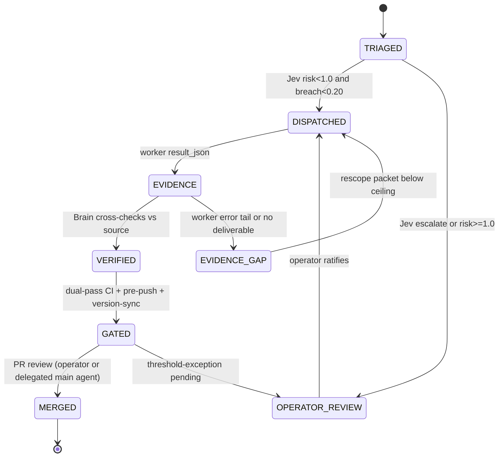

# ADR-0021: Standard Operating Model (SOM) for Agent-Driven Development

**Status**: Accepted
**Date**: 2026-09-25
**Deciders**: Brain/main agent (operator-delegated)
**Related**: ADR-0020 (reflex-gated campaign); `wiki-adlc` gate contract; #329 (reflex CLI enforcement); #334 (delegated-write unlock); #332 (docs drift hub)

---

## Context

The 2026-09-25 campaign validated an ad-hoc operating pattern across 10 worker
tasks, 5 PRs, 5 releases-adjacent fixes, and 9 filed issues. The pattern worked
but lived only in session memory and the campaign ledger. To make it repeatable
across sessions, workers, and future maintainers, the operating model is
standardized here — as ADR, not prompt, because prompts do not survive context
windows; ADRs, CI gates, and CLI flags do.

## Decision

### 1. Roles (fixed vocabulary)

| Role | Authority | Constraint |
|------|-----------|------------|
| **Operator** (human) | Final merge authority on threshold-exception mutations; owns roadmap intent | Dispatches goals, not file edits |
| **Brain / main agent** | Orchestration, commits, PRs, issue lifecycle, receipts, adjudication of escalations | Every mutation Jev-triaged; never merges own threshold-exceptions silently |
| **Jev (System-1 sensor)** | Empirical risk/breach telemetry on every planned mutation | Measures, never decides; kill-rule authoritative |
| **Worker fleet** (agy/flash) | Bounded recon, verification, docs synthesis, red-team probes | `read_only` default; worktree-isolated; ≤ ~450K tokens/task (measured ceiling) |

### 1a. Three-Tier Responsibility Stack (vertical model)

The horizontal FSM above operates inside a vertical stack of three knowledge
tiers. Each tier answers a different question and fails differently when
skipped (Descent Output, `wiki-deep-why` protocol, 2026-09-25):

| Tier | Question it owns | Mirrors (product architecture) | Exists because | If skipped |
|------|------------------|-------------------------------|----------------|------------|
| **T1 — Main agent: project direction** | "Is the project going the right way?" | Brain tier (receipt issuance, commits, architecture authority) | Concurrent sessions need one accountable owner; D6 showed refs moving under an active session twice | Duplicated implementations, roadmap fiction, session thrash |
| **T2 — Orchestrator/supervisor: dogfood** | "Is the work coordinated through the tool's own transport?" | Supervisor fix loop (Concern A: orchestrate → worker) | g8s *is* a supervisor harness; managing it any other way disproves its own claims | The tool rots its advertised promises silently (e.g. #334: delegated-write dead while documented) |
| **T3 — Self-optimization: supervisor + workers** | "Are the coordinator and the workers getting cheaper and more accurate?" | Meta-optimizer (Concern C: measure → learn → tune) | Supervisor and workers are the scarce resource (token budget); ceilings and channel bugs compound into every future slice | Every session re-pays the same tuition; broken channels corrupt evidence silently (#328, #331, #329) |

Escalation direction is bottom-up: T3 findings (calibration, ceilings,
channel defects) become T2 protocol changes; T2 evidence gaps become T1
roadmap decisions. No tier may be bypassed downward — T1 never does T3's
work directly (measuring, classifying) when a worker or sensor can; T3 never
changes protocol without T1 ratification through this ADR's amendment path.

### 2. Slice lifecycle (every unit of work follows this FSM)

## State Diagram



Gate semantics (all enforce-code, not prose): Jev triage before mutation
(ADR-0020); dual-pass CI (`CGO_ENABLED=0 go test ./...` +
`CGO_ENABLED=1 go test -race ./...`); pre-push 12-gate script;
`version-sync.yml` (code/CHANGELOG/packaging); docs-contract gate
(`tools/ci_doc_contract_check.sh`); pending: reflex CLI gate (#329),
delegated-write E2E (#334).

### 3. Problem-class → handling matrix

| Problem class | Detection | Handling |
|---|---|---|
| **A. Defect** (reproducible wrong behavior) | worker recon + Brain verify | issue → PR → merge; regression test mandatory |
| **B. Drift** (docs/spec/roadmap vs reality) | audit workers + doc-contract gate | evidence table → targeted PR; never a blind rewrite |
| **C. Ceiling** (worker/model limits) | error-tail transcripts, token counts | measure → record in provider registry → rescope packets |
| **D. Contention** (multi-session/multi-worker) | unexpected refs/HEAD/worktree state | isolate: per-worker worktrees, session-scoped state (fix: #327/#334); recover via reflog, document in PR |
| **E. Calibrated-false-escalation** (gate fires but evidence benign) | 3× triage variance check | adjudicate with recorded rationale + enhanced verification; never silently bypass |
| **F. Garbage** (draft releases, scratch branches, /tmp artifacts) | `cleanup --dry-run`, release list | sweep with verify-tag-delete; preserve unique tips (`keep/scratch-*` tags) |

### 4. E2E acceptance checklist (a slice is DONE only when all hold)

1. Issue open → PR merged (or explicitly closed with evidence).
2. Jev triage verdict recorded in the ledger for every mutation.
3. Dual-pass gates + pre-push green **on the merged tree**.
4. Docs/spec/ledger updated in the same PR (no deferred "I'll document later").
5. Zero garbage left: no orphan worktrees, no scratch branches without tags,
   no draft releases, no unpushed local-only state without a safety tag.
6. A different agent can reproduce the evidence (ADLC WA-8).

### 5. Debt policy

- Debt is triaged into the **v0.x roadmap sections** of
  `docs/REFACTORING_PLAN.md` at merge time (P0/P1 next minor, P2 the one after).
- Findings from dogfooding are **issues first** (tracking), then slices —
  never fixed inside unrelated PRs.
- The ledger (`plans/<date>-<campaign>/plan.md`) is the SSoT for a campaign;
  ADRs are the SSoT for decisions; issues are the SSoT for open work.

### 6. Automation loop (goal: run the project on rails)

The product ships its own autopilot (`internal/autopilot`, `g8s autopilot`,
shipped v0.3.0) and cleanup sweeper. The strategy is to close the loop with
what already exists rather than build new machinery:

| Loop | Mechanism | Status |
|---|---|---|
| Nightly hygiene | `g8s cleanup --dry-run` in scheduled CI (hygiene-guard.yml) | ✅ exists — extend to close-pr/scratch classes (#326/#327) |
| Release train | tag-push → GoReleaser (release.yml), version-sync pre-check | ✅ exists — used for v0.10.1 |
| Docs truth | doc-contract gate + periodic audit workers (#332) | ✅ gate merged; audits on-demand |
| Mutation gate | Jev triage via `g8s reflex triage` in CI + dispatch path | 🔄 #329 |
| Delegated write | receipt → workspace_write → consume → mutation detector | 🔄 #334 (currently disabled) |
| Escalation feedback | `g8s supervisor-metrics-update-false` | ✅ exists |

### 7. Transparency contract

Roadmap truth lives in exactly three places, kept in sync by the version-sync
and docs-contract gates: `manifest.json` (milestones M1–M6),
`docs/REFACTORING_PLAN.md` (release history + forward plan),
`CHANGELOG.md` (shipped facts). Any PR that changes one must change all —
the version-sync gate enforces the version pair, the doc-contract gate enforces
structure.

## Red Test Proof

Red→Green→Refactor protocol for the gates this ADR standardizes:

1. **RED**: packaging drift gate must fail on a stale literal —
   `sed -i '' 's/0.10.1/0.4.0/' packaging/windows/g8s.nsi && grep '^[[:space:]]*Version' cmd/g8s/version.go` then run the
   version-sync check locally: `bash -c 'VERSION_CODE=$(grep "^[[:space:]]*Version[[:space:]]*=" cmd/g8s/version.go | head -1 | sed "s/.*= *\"\([^\"]*\)\".*/\1/"); LITERAL=$(grep -oE "\"[0-9]+\.[0-9]+\.[0-9]+\"" packaging/windows/g8s.nsi | head -1 | tr -d "\""); [ "$LITERAL" = "$VERSION_CODE" ] || exit 1'` → Expected: **exit 1** (mismatch detected).
2. **GREEN**: with synced literals (`grep -h "0.10.1" packaging/windows/*.nsi packaging/windows/*.wxs packaging/chocolatey/tools/chocolateyinstall.ps1 cmd/g8s/version.go`) the same check exits **0**; CI `Version Sync Validation` job passed on PR #330/#333 (run 36035232960).
3. **REFACTOR**: the check moved from session-run shell into
   `.github/workflows/version-sync.yml` ("Check packaging installer version
   drift" step) — enforced on every push/PR to main, not on agent honesty.

State-machine sanity check: `go test ./internal/cleanup/ -run TestCleanup -count=1` exercises the sweep FSM transitions (detect → would_* → acted) — red before #326-class fixes land, green after.

## Consequences

- Every future session (human or agent) inherits the same FSM, gates, and
  checklists — onboarding cost drops from "read the campaign ledger" to
  "read this ADR".
- The model exposes its own gaps as tracked issues (#327, #329, #331, #334)
  rather than hiding them behind convention.
- Risk: gate theater if checks drift from reality — mitigated by the
  anti-theater rule (substance over form) and the periodic audit workers.

## 8. Distributed Reflex Architecture (v0.11.0, operator-directed)

Jev is not a checkpoint — it is a distributed nervous system deployed at
every decision point. Each deployment has its own Context Broker (assembles
the enriched TriageRequest), its own Sensor query, and its own deterministic
Policy rules.

### 8.1 Deployment points

| Layer | Decision | Package | Status |
|-------|----------|---------|--------|
| L1 | Pre-dispatch mutation risk | `internal/reflex` → `cmd/g8s/submit.go` | ✅ Shipped |
| L2 | Brief quality (DoR check) | `cmd/g8s/brief_issue.go` (preflight) | 🔧 Preflight done, Jev gate pending |
| L3 | Post-run output quality | `internal/worker/worker.go` → `collect()` | ✅ Shipped (#387) |
| L4 | Skill routing | *(new)* `internal/routing` | ❌ Needs design |
| L5 | F1→F2 spawn gate | *(new)* — requires OpenSpec delta | ❌ |
| L6 | PR triage | `g8s reflex triage` → CI | ✅ Shipped (#372) |
| L7 | Escalation context | `internal/worker` → escalator | 🔧 Framework exists |
| L8 | Session lifecycle | `internal/autopilot` | 🔧 Engine exists |

### 8.2 Context Broker (planned: `internal/context`)

Assembles a `ContextPacket` per deployment point by querying:
- Knowledge Vault (DELTA-11): historical patterns, operator preferences
- Telemetry ledger (#253/#363): recent outcomes, failure signatures
- SOM state (ADR-0021): current phase, DoR status

The enriched `TriageRequest` gives Jev enough context to make situationally
aware decisions — not just "is this dangerous?" but "is this the right action
for this situation?"

### 8.3 Skills mapping (L4 skill routing design sketch)

The skills bank (supervisor, autoreview, debug, code-simplification, etc.)
maps to deployment points:

| Skill | Deployment | Jev question |
|-------|-----------|--------------|
| `autoreview` | L6 PR triage | "Does this diff pass the quality bar?" |
| `debug` | L3 post-run | "Is this output genuine or hallucinated?" |
| `code-simplification` | Stage 7 | "Is this diff minimal and clean?" |
| `g8s-supervisor` | L1 pre-dispatch | "Is this brief ready for dispatch?" |

Jev scores the match; the Brain approves or overrides — enforce-code
routing, not prompt-level.

### 8.4 Contribution prompting template

When a user reports a bug/feature via g8s, the Brain routes it into a
well-formed issue using this template:

```
Title: [<TYPE>] <one-line summary>
Labels: <bug|enhancement|debt>, <severity>, <area>

Body:
- Evidence (repro command or file:line)
- Expected vs actual behavior
- Impact assessment
- Proposed fix (if known)
- DoD checklist
```

This ensures every user report becomes an actionable issue without manual
cleanup by the Brain.
