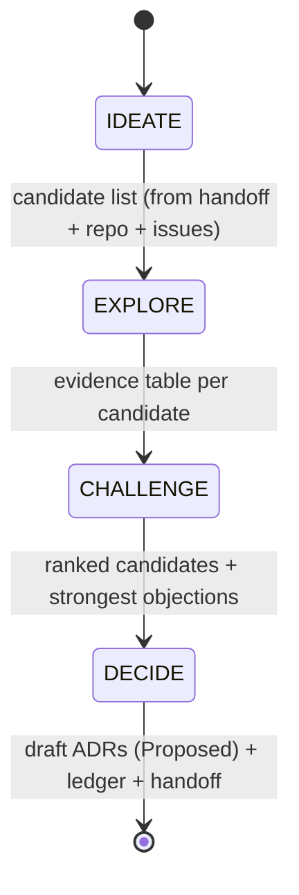

# ADR-0022: Strategic Session Protocol (T1/T2 Session-Type Separation)

**Status**: Accepted
**Date**: 2026-09-26
**Deciders**: Operator (TamLD) ratified in T1 strategy session, 2026-09-26; drafted by Brain/main agent
**Related**: ADR-0021 (SOM, tier stack + execution FSM); ADR-0020 (reflex gate); `plans/handoffs/strategic-handoff-20260926-1030.md` (origin evidence); `plans/260926-strategy-t1-session/plan.md` (first T1 ledger)

---

## Context

ADR-0021 standardizes the **execution** FSM (`TRIAGED → DISPATCHED → EVIDENCE →
VERIFIED → GATED → MERGED`) but defines no lifecycle for **strategy** work. The
2026-09-25 campaign ran strategy questions through execution machinery: the Brain
kept dispatching worker tasks because dispatching is what the FSM rewards, and
produced zero durable architecture insights across 40+ PRs. Only when the session
was force-stopped, handed off to fresh context, and explicitly barred from
execution did the insights surface — 9 brainstorm topics (Context Broker, session
isolation, skill routing) emerged within one fresh-context session.

Three failure modes motivated this ADR:

1. **Mode collapse**: a session defaults to execution because the existing FSM
   only has execution states. "When you have a hammer FSM, everything looks like
   a nail."
2. **Context contamination**: strategy thinking drowned in per-PR detail. Fresh
   context (handoff doc only) saw structural gaps the loaded context could not.
3. **Ad-hoc handoffs**: the handoff document that unlocked the insight was
   invented on the spot. Nothing guarantees the next session writes one, or that
   it carries the same sections.

Cost evidence: 1 handoff exists (`plans/handoffs/`); the pattern is new, so this
ADR codifies the structural argument, not yet a recurrence.

## Decision

### 1. Session types (fixed vocabulary)

| Type | Name | FSM | Inputs | Outputs | Forbidden |
|------|------|-----|--------|---------|-----------|
| **T1** | Strategy session | IDEATE → EXPLORE → CHALLENGE → DECIDE | handoff doc, ADRs, open issues, roadmap anchors, `manifest.json` | draft ADRs (Proposed), strategy ledger, next-session handoff | merging code, fixing bugs, creating execution issues, cleaning garbage |
| **T2** | Execution session | ADR-0021 FSM unchanged | ratified strategy items, issues with DoR | merged PRs | silent scope expansion into strategy (new architecture decisions) |

A T1 session never merges its own conclusions: DECIDE emits **Proposed** ADRs and
ledger entries; the operator ratifies (same authority split as ADR-0021 roles).

### 2. T1 FSM



| State | Rule | Gate to next state |
|-------|------|--------------------|
| **IDEATE** | Enumerate candidates; no evaluation, no code reading yet | Every handoff topic represented + free additions |
| **EXPLORE** | Evidence per candidate from the repo itself (code, issues, ADRs, git state); claims tagged observed/derived/assumed | Each candidate has ≥1 load-bearing fact checked |
| **CHALLENGE** | Strongest objection per candidate, cost, falsification test | Leading candidates have a named kill-test |
| **DECIDE** | Per candidate: RATIFY (draft ADR) / DEFER (roadmap anchor) / KILL (recorded rationale) | Ledger written; Jev-triaged before any file mutation |

Mutation gate is unchanged from ADR-0020: T1 sessions Jev-triage before writing.

### 3. Composition: T1 DECIDE feeds T2 TRIAGED

The two FSMs are one lifecycle, not two processes:

```text
T1: IDEATE → EXPLORE → CHALLENGE → DECIDE ──(operator ratifies)──> T2: TRIAGED → … → MERGED
T2 findings (ceilings, channel defects, dogfooding) ──> next T1 IDEATE inputs
```

This closes the loop ADR-0021 §1a opened: escalation stays bottom-up, and
strategy output enters execution only through the existing TRIAGED gate with a
Jev triage — no new machinery.

### 4. Context contract (what "fresh context" means, concretely)

| Direction | MUST carry | MUST NOT carry |
|-----------|-----------|----------------|
| into T1 | handoff doc, ADR-0021/0022, open issues, roadmap anchors, manifest.json | per-PR diffs, mid-review state, worker transcripts, campaign trivia |
| into T2 | ratified ADRs, issue DoRs, the T1 ledger's DECIDE table | unresolved strategy debates (they were DECIDEd or DEFEREd) |

Rationale: the fresh-context session of 2026-09-26 produced the campaign's only
architecture insights; context weight was the measurable difference.

### 5. Handoff protocol

A session (T1 or T2) MUST end with a handoff document in `plans/handoffs/` when
either: (a) context budget is mostly consumed, or (b) a natural milestone is
reached (release merged, backlog zero). The handoff follows the fixed template
validated by `strategic-handoff-20260926-1030.md`:

1. Mission and current status
2. Scope and guardrails (do-not-relitigate table)
3. Current state (repo, releases, branches, worktrees)
4. Decisions and rationale
5. Work performed
6. Verification
7. Open risks and blockers
8. Exact next actions (first safe step + "do NOT start with")
9. Source pointers (artifact → path table)

### 6. Session-type marker (enforce-code, not prose)

Every ledger `plans/<date>-<slug>/plan.md` declares its session type in the
header: `**Session type**: T1 (strategy)` or `**Session type**: T2 (execution)`.
Enforcement lands as a `tools/ci_doc_contract_check.sh` extension (T2 slice,
deferred — this ADR only defines the contract).

## Red Test Proof

1. **RED** (observed, prior campaign): an execution session asked to brainstorm
   produced 0 durable strategy artifacts across 40+ merged PRs — the ledger
   `plans/260925-debt-campaign/plan.md` records work items only, no candidate
   analysis.
2. **GREEN** (observed, this session): first T1 session under this protocol
   produced this ADR (Proposed) + `plans/260926-strategy-t1-session/plan.md`
   with all 9 topics DECIDEd + the next handoff, in one session, zero code
   mutations.
3. **REFACTOR** (deferred): doc-contract gate gains the session-type marker
   check; the gate, not agent honesty, carries the rule.

**Falsification**: if the next campaign runs to completion without session-type
markers and misses nothing the prior session missed, this ADR is gate theater —
kill it via the amendment path.

## Alternatives considered

- **Do nothing** (ad-hoc handoffs forever): rejected — the failure cost a full
  campaign's strategic capacity; protocol cost is two markdown files.
- **Session state machine in code** (`g8s session --type`): rejected — violates
  the SOM principle of closing loops with what exists; a single-operator project
  does not need session lifecycle enforcement in the binary yet.
- **Strategy as dispatched worker tasks**: rejected — workers have bounded
  context (measured ceiling ~450K tokens) and no authority to propose ADRs;
  strategy is definitionally Brain work (Constitution Axiom 1).

## Consequences

- Strategy becomes repeatable and onboardable: a new session reads two ADRs
  instead of reverse-engineering session history.
- Handoffs become predictable artifacts with a fixed template, not per-session
  improvisation.
- Cost: short sessions carry the marker overhead (one header line) — negligible.
- Risk: gate theater (ADR-0021's own warning applies verbatim) — mitigated by
  the falsification clause above and by keeping the protocol to 2 files + 1 gate
  extension, not new machinery.
