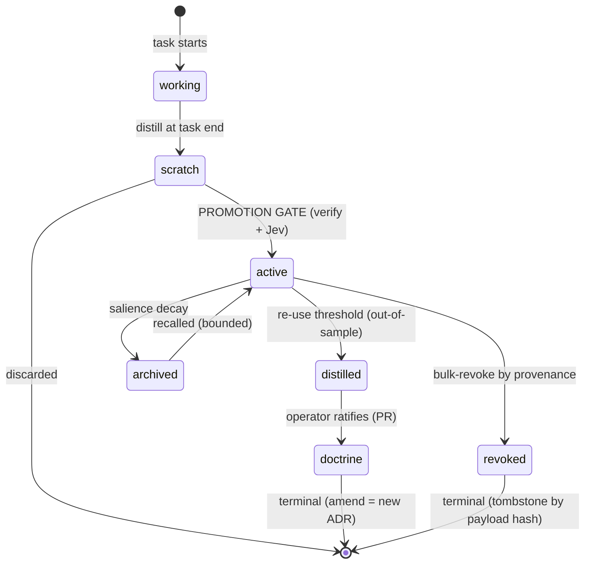

# ADR-0023: Memory Lifecycle — States, Labels, Gates, and Termination Guarantees

**Status**: Proposed
**Date**: 2026-09-26
**Deciders**: Operator via 3-round T1 brainstorm (states → protocol → termination); drafted by Brain/main agent
**Related**: #395 (promotion gate slice), #396 (Context Broker consumer), ADR-0021 §8.2 (Context Broker sketch), ADR-0022 (session protocol), PR #399 (sessions registry — same pattern, prior application), DELTA-11/21 (storage+retrieval SSoT — unchanged by this ADR)

---

## Context

DELTA-11/21 standardize memory **storage** (SQLite WAL, FTS5 BM25 + vector hybrid)
and **retrieval**, but define no lifecycle: the vault accepts writes ungated
(`grep promote internal/memory` = 0), entries have no trust labels, no aging,
no revocation. Once the Context Broker (#396) reads the vault into every Jev
decision, an ungated vault becomes a poison amplifier. Separately, preflight
injection has **no budget enforcement** — live-red captured 2026-09-26:
`InjectPreflightContext` emitted **80,455 chars** against the <4K working-context
axiom (20× over; see Red Test Proof).

This ADR adds the lifecycle layer. It changes no storage engine and no retrieval
engine — it adds **states, labels, gates, and termination guarantees** on top.

## Decision

### 1. Two-level state model

**Entry-level FSM** (per memory item):

Trust-bearing path (`scratch → active → distilled → doctrine`) is a **DAG** —
no upward re-entry (G5). Cycles exist only on decay paths (`archived ⇄ active`,
salience-bounded) and both terminal states are absorbing.

**System-level states** (MMU view): `COLD` (empty index — BM25-only, honest
cold-start) · `WARM` (full hybrid) · `SATURATED` (context pressure — eviction by
salience) · `DEGRADED` (gate down → fail-open + `broker_failure` telemetry; index
stale → BM25-only) · `QUARANTINE` (revocation sweep in progress — reads OK,
writes blocked).

### 2. Label schema (labels ARE the allocation policy)

| Label | Values | Set by |
|-------|--------|--------|
| `kind` | fact / judgment / decision / procedure | capture-time classification — **determines sharing speed** |
| `lifecycle` | the 7 FSM states | gates |
| `trust` | unverified / jev_checked(risk, verdict_ref) / operator_ratified | Jev at gate; operator at doctrine |
| `salience` | reuse_count + last_used_at → hot/warm/cold | measured counters (v1: no more machinery) |
| `scope` | task / session / global | origin context |
| `provenance` | session_id, task_id, promoted_by | system-stamped — the bulk-revoke path |

STM = `working` + `scratch` (bounded, dies fast). LTM = episodic (g8s.db) +
semantic vault + doctrine (git). `archived` = LTM-cold. No fourth tier.

### 3. Gates (the only trust boundaries)

1. **Promotion gate** (`scratch → active`): `Propose(entry)` → deterministic
   checks (tri-anchor, required labels, **tombstone lookup by payload hash**) →
   Jev scores the **naked payload** (trust labels stripped — G3) → `Activate`
   with trust label, or reject (recorded in telemetry). Workers never call
   Propose — promotion is Brain-side; a worker gating itself is a conflict of
   interest.
2. **Revocation** (`→ revoked`): deterministic bulk by provenance
   (`revoke --session <id>`), writes **content-hash tombstones** (G1). Triggered
   by operator or by L3 Jev detection (hallucination → revoke candidates).
   Tombstone set is monotone — un-revoke is operator-only.
3. **Doctrine** (`distilled → doctrine`): operator-only, via PR — doctrine
   ships through the same 12-gate pipeline as code. Never automated.

### 4. Transport (nothing new is invented)

| Flow | Transport | Status |
|------|-----------|--------|
| capture (output → scratch) | distiller, in-process | exists |
| promote (scratch → vault) | Gate API (this ADR) | new — #395 |
| inject (vault → context) | ranked label query → AIC brief envelope | query new, envelope exists |
| doctrine (vault → git) | PR through existing gates | exists |

`MemoryEntry v1` protocol borrows the receipt envelope pattern
(`envelope_schema_uri: g8s.memory.v1`, provenance block, ruleset versioning).
No cross-machine memory sync — single-tenant; that is A2A/product territory.

### 5. Injection budget (G6, live-red today)

Every injection is a **read with a hard budget**: ≤4,096 chars, ranked
truncation by `kind × salience × trust × scope-match`. Per-decision-point
filters: L1 (judgment+fact, global, trust≥jev_checked), L2 (fact+procedure,
task+global), L3 (fact, task). **The read path never calls Jev** — deterministic
query only; Jev sits at write boundaries and detection, never in the hot loop.

### 6. Termination guarantees (G1–G6) — the loop must end

| Guard | Rule | Kills |
|-------|------|-------|
| **G1** | tombstones keyed by **payload hash**; set is monotone | resurrection: re-captured poison stays dead |
| **G2** | `reuse_count` increments only for **out-of-sample** corroboration (outcome that did not read the entry); contradiction decrements more than corroboration increments (asymmetric, mirrors `negative_patterns`) | echo chamber: belief must be re-earned against reality, not itself |
| **G3** | gate's Jev request strips trust labels | trust laundering |
| **G4** | no meta-entries — memory-about-memory exists only as counters and tombstones; recursion depth = 1, by fiat | infinite regress |
| **G5** | trust path is a DAG; terminal states absorbing | promotion ping-pong |
| **G6** | injection budget hard cap | unbounded cost per cycle |

With G1–G4 active, every promotion chain terminates or converges: fixed points
are `doctrine` (human-ratified), `revoked`+tombstone (forbidden), `archived`
(cold). The search→decide→distill loop is allowed to run — each cycle is O(1)
in cost and cannot amplify uncorroborated belief.

### 7. v1 scope (YAGNI rank)

V1 (#395): FSM + labels migration, promotion gate with tombstones (G1),
meta-entry rejection (G4), budget cap (G6), naked-payload gate (G3), CLI
`g8s memory list/revoke`. v1.1: G2 out-of-sample counters (outcome↔entry
linkage; telemetry data exists). Deferred: formal belief-score mathematics
(counters first; formalize only if data shows oscillation).

## Red Test Proof

**Live RED captured 2026-09-26 (G6 is false in shipped code today):**

1. **RED**: `CGO_ENABLED=0 go test ./internal/telemetry/ -run TestInjectPreflightBudgetCapRED -count=1` → **exit 1** —
   `injection = 80455 chars, want <= 4096 (ADR-0023 G6 budget cap)`
   (test materialized 50 large `NegativePattern`s through the exported
   `InjectPreflightContext`; evidence recorded, temp test file removed —
   the test becomes permanent in #395 and goes GREEN there.)
2. **GREEN** (post-#395): same command → exit 0.

**Contract for the remaining claims** — each becomes a first-class failing test
at the start of the #395 slice (RED before implementation, GREEN after):

| # | Claim | Test | RED mechanism today |
|---|-------|------|---------------------|
| C1 | FSM transitions enforced; doctrine/revoked absorbing | `TestMemoryLifecycleFSMTransitions` | no lifecycle API |
| C2 | unverified entry cannot become active | `TestPromotionRequiresGate` | no Propose/Activate |
| C3 | revoked payload cannot re-enter (new id, same hash) | `TestRevokedPayloadCannotReenter` | no tombstones |
| C4 | in-sample corroboration does not raise salience | `TestReuseRequiresOutOfSampleCorroboration` | no salience fields |
| C5 | gate's Jev request carries no trust labels | `TestGateStripsTrustLabels` | no gate |
| C6 | meta-entries rejected | `TestMetaEntryRejected` | no validation |
| C7 | injection ≤4096 under overflow | `TestInjectPreflightBudgetCap` | **live-red (80,455 chars)** |
| C8 | read path succeeds with sensor down | `TestInjectWorksWithSensorDown` | read path Jev-free by construction |
| C9 | `revoke --session X` sweeps + tombstones all X's entries | `TestBulkRevokeBySession` | no revoke API |
| C10 | doctrine changes only via new ADR | process-enforced (git history + doc-contract gate) — not a code test | bounded rationale per prove |

## Alternatives considered

- **Do nothing** (ungated vault): rejected — amplifier risk once #396 lands;
  live-red shows the budget side is already broken.
- **Formal belief calculus now**: rejected for v1 — counters carry the same
  guarantees with testable simplicity; formalize on evidence.
- **Cross-machine memory sync protocol**: rejected — single-tenant Non-Goals;
  revisit only under the A2A product decision (#258 Phase B).

## Consequences

- Memory gains a trust lifecycle without touching DELTA-11/21 engines — the
  label columns are one additive SQLite migration (same shape as PR #399).
- Poison gains three walls: tombstones, naked-payload gating, provenance
  revocation; budgets bound the blast radius of whatever slips through.
- Cost: every capture pays one gate evaluation at promotion time (not at
  read time); risk of label proliferation — **v1 freezes 4 kinds, 3 scopes,
  7 states**; new labels require an ADR amendment, not a drive-by PR.
- Falsification: if post-#395 telemetry shows promotion gate rejections ≈ 0
  AND zero tombstone hits over a campaign, the gate is theater — simplify it
  away via amendment.
