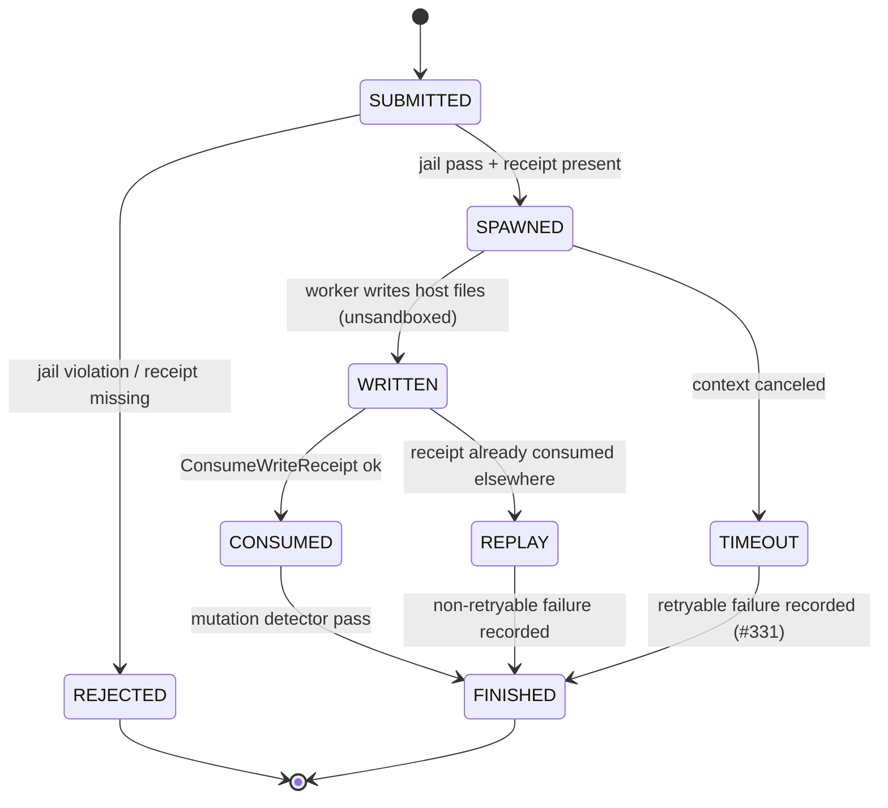

---

**Session type**: T2 (execution)
title: "Plan: Delegated-Write Materialization Verification + Workspace Jail"
tags: [receipt, sandbox, jail, security, e2e, dogfood]
status: planned
adr: [docs/decisions/0020-reflex-gated-debt-campaign.md, docs/decisions/0021-standard-operating-model.md]
issues: [#346, #348]
blockedBy: []
blocks: []
---

# Plan: Delegated-Write Materialization Verification + Workspace Jail

Approved by operator ("duyệt") after the debt-zero campaign. Two approved
design decisions from the 2026-09-25 campaign:

## Context

- **#346**: the delegated-write loop's consume link is fixed (#352), but
  *result materialization* is unproven: the campaign E2E (receipt fb78986a,
  task a59c53e7) timed out — the worker wasted its budget searching
  `find /Users/tamld` because the packet lacked explicit paths, ending in
  `context canceled`. The worker argv path (`buildArgv`) already omits
  `--sandbox` for `workspace_write`, so unsandboxed host writes are *expected*
  to work — **unverified**.
- **#348**: denied-path validation is a fragment blacklist; there is no
  workspace-jail containment for `--add-dir`. Cross-root add-dirs are
  legitimate by design (documented workflows), so a hard cwd jail would break
  them — the approved design is an **explicit scope-root model**: default root
  is the submitter's cwd; extra roots are opt-in via repeatable `--scope-root`.

## State Diagram

## Red Test Proof

Red→Green→Refactor protocol:

1. **RED (jail)**: `g8s submit --role test-runner --permission workspace_write --receipt-id <id> --add-dir /etc --scope-root .` →
   Expected: **FAIL** with `add-dir ... is outside scope roots` (exit harness error) — the jail does not exist yet, so today this submission is *accepted* (the red state).
2. **GREEN**: implement `harness.ValidateScopeJail` + CLI `--scope-root` wiring → the same command fails closed; `--add-dir .` with default root passes → jail tests `TestValidateScopeJail*` go PASS (`go test ./internal/harness/ -run TestValidateScopeJail -count=1`).
3. **RED→GREEN (materialization)**: bounded E2E — receipt scoped to
   `e2e-delegated-write.txt`; workspace_write task writes that exact file;
   assert the host repo contains it (`test -f`) and the receipt row has
   `consumed=1, consumer_task_id=<task>` (`sqlite3 ... SELECT consumed ...`)
   → red today (unproven), green after verification or export fix.

## Solution Design

### T1 — Workspace jail (harness + cmd)
- `harness.ValidateScopeJail(addDirs []string, roots []string) error`:
  resolve each dir (Clean → `~` expand → Abs → EvalSymlinks); reject any dir
  whose `filepath.Rel(root, dir)` starts with `..` for **every** root; also
  run the existing denied-fragment check (reuse `ValidateScopePath`).
- `cmd/g8s submit`: new repeatable `--scope-root` flag (default: cwd);
  call the jail before enqueue; error names the offending dir and the roots.
- `controlplane.ValidateSubmitRequest` gains a second-line defense: reject
  `add_dirs` containing `..` segments or empty strings (defense-in-depth;
  the CLI is not the only submit surface).

### T2 — Materialization E2E verification (evidence task)
- Bounded packet: receipt scoped to `e2e-delegated-write.txt`; prompt names
  the exact relative path and one-line content; timeout 120s; model
  gemini-3.8-flash-high; read the result; assert host file + consumed row.
- Decision gate: if the host file does not exist after a COMPLETED task →
  implement an export step in `collect()` (scan run dir for the sandbox
  scratch root, copy changed files back, then run the mutation detector)
  before closing #346. If it exists → close #346 with the evidence.

### T3 — Roadmap: speed & multi-session capability (docs)
Add to `docs/REFACTORING_PLAN.md` v0.11/v0.12 (operator request):
- Session-scoped state isolation (per-session g8s.db namespace or repo-lock)
  for concurrent supervisors — closes the D6 contention class.
- Worktree-isolated `worker --once` default (bare shared-checkout dispatch
  requires an explicit `--in-place`).
- Parallel dispatch tuning: FanOut concurrency exposed in config; session
  quotas enforced per submitter (#291 schema already carries session_id).
- CLI envelope conformance suite + `result_validation` output-contract hook
  (#331 remainder) as a quality gate.
- Channel latency: bounded, streaming result reads (`g8s get --tail`) for
  long-running worker sessions.
Track as issues at merge time; the roadmap rows reference them.

## Tasks

| # | Task | Files | Verification |
|---|------|-------|--------------|
| 1 | Jail helper + tests | internal/harness/harness.go, harness_test.go | `go test ./internal/harness/ -run TestValidateScopeJail` |
| 2 | CLI --scope-root + wiring | cmd/g8s/submit.go | manual + red-test command flips to rejected |
| 3 | CP second-line defense | internal/controlplane/lifecycle.go | unit test `..`/empty rejection |
| 4 | Materialization E2E | (evidence, no code unless gate triggers) | sqlite consumed=1 + host file |
| 5 | Roadmap rows | docs/REFACTORING_PLAN.md | doc-contract gate |
| 6 | Ledger addendum | plans/260925-debt-campaign/plan.md | — |

## Risks

- Jail default-ON may break external add-dir workflows → escape hatch is
  `--scope-root`; release notes call it out.
- agy sandbox behavior may differ from the no-sandbox assumption → decision
  gate T2 covers the export fallback.
