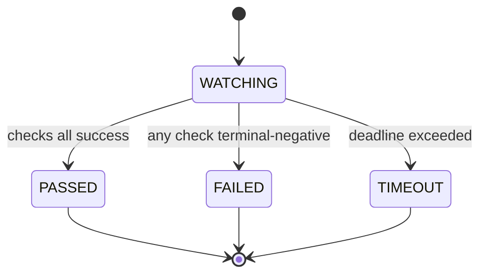

# Plan: g8s watch — push-channel primitive

Closes the supervisor-notification gap from #370: a blocking command that
exits exactly when the watched condition is terminal. Run it in the
background — the process-exit notification replaces all sleep-polling.

## State Diagram

## Red Test Proof

1. **RED**: watch with a checker that never satisfies and timeout=50ms →
   \`go test ./internal/watch/ -run TestWatchTimeout\` → expected **exit-path
   TIMEOUT verdict** (currently the package does not exist — build fails,
   the red).
2. **GREEN**: implement the poll loop with an injectable checker; a
   satisfying checker returns PASSED on the second poll → test asserts
   verdict=passed and 2 polls (no real sleep — injectable sleeper).
3. **REFACTOR**: PR and task targets share the loop; targets differ only in
   their checker function.

## Tasks

1. internal/watch: Watcher{Checker, Interval, Timeout, Clock, Sleeper} →
   Verdict{State, Failed, Elapsed}; unit tests (timeout, pass, fail, poll count).
2. cmd/g8s/watch.go: --pr (gh pr checks) + --task (controlplane state) targets,
   JSON envelope, exit codes 0/1/2, --help.
3. Demo: background-watch a live PR; harness notification fires on exit.
