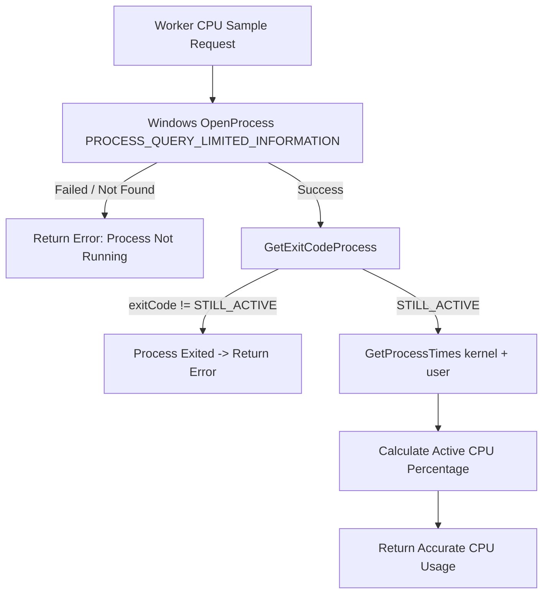

# Plan: Complete Issue #336 — Windows Runtime Gaps Closure

## Context & Objectives

Issue #336 identified 5 cross-platform gaps on Windows. 
- HIGH priority item (signal handling) was resolved via PR #343.
- CI promotion was resolved via PR #345.
- Worktree doc claim was aligned in PR #356.

The remaining open requirements to close #336 definitively are:
1. **Windows Real Process Liveness & CPU Sampling (`internal/worker/cpusample_windows.go`)**:
   - Current implementation returns a dummy static `5.0` and calls `os.FindProcess(pid)` which never fails on Windows, falsely reporting dead or non-existent processes as active.
   - Fix: Query true process liveness and execution state via Windows API (`OpenProcess`, `GetExitCodeProcess`, `GetProcessTimes`). If the process has exited or does not exist, return an error/idle state. Calculate CPU consumption ratio from `kernelTime + userTime` over elapsed wall clock time.
2. **RFC-8089 Compliant SQLite URI Builder (`internal/pathutil`)**:
   - `url.PathEscape(dbPath)` on Windows converts backslashes to `%5C` and drive colons to `%3A` (e.g. `C%3A%5CUsers...`), producing malformed, non-standard URIs that break interoperability with external tools.
   - Fix: Implement `FormatSQLiteURI(dbPath string, pragmas string) string` in `internal/pathutil` that:
     - Normalizes backslashes to forward slashes `/`.
     - Preserves the Windows drive prefix (`C:/`) or UNC host.
     - Escapes query-delimiter characters (`?`, `#`, `&`) in the file path safely to prevent connection string injection (satisfying `.jules/sentinel.md`).
     - Updates callers (`internal/controlplane/store.go`, `internal/receipt/receipt.go`, `internal/vault/vault.go`, `internal/telemetry/engine.go`, `internal/cleanup/cleanup.go`, `internal/doctor/doctor.go`, `cmd/g8s/cleanup_test.go`).
3. **Comprehensive Windows Native Verification**:
   - Run `go test -v ./internal/worker/...` and `go test -v ./internal/pathutil/...`.
   - Run `go test ./...` across all packages on Windows.
   - Run `go vet ./...`.

---

## State & Flow

---

## Implementation Phases

### Phase 1: Implement Windows Process Liveness & CPU Sampling
- [x] Edit `internal/worker/cpusample_windows.go`:
  - Replace `os.FindProcess` with `windows.OpenProcess(windows.PROCESS_QUERY_LIMITED_INFORMATION, false, uint32(pid))`.
  - Check `windows.GetExitCodeProcess(h, &exitCode)` against `windows.STILL_ACTIVE` (259).
  - Inspect `windows.GetProcessTimes` to compute process CPU time vs elapsed time.
- [x] Add unit tests in `internal/worker/cpusample_windows_test.go` verifying:
  - Current process (`os.Getpid()`) returns valid CPU usage and `err == nil`.
  - Invalid PID (`-1` or `99999999`) returns an error indicating process is not running.
- [x] Verify `go test -v ./internal/worker/...` passes.

### Phase 2: Centralize RFC-8089 SQLite URI Builder in `internal/pathutil`
- [x] In `internal/pathutil/pathutil.go`:
  - Add `SQLiteURI(dbPath string, queryParams string) string`.
  - Handle Windows drive prefix (`C:/`), UNC paths, and Unix absolute paths.
  - Escape injection characters (`?`, `#`, spaces) in path segments without corrupting drive letters or directory slashes.
- [x] Add comprehensive tests in `internal/pathutil/pathutil_test.go` checking:
  - Windows absolute path `C:\data\g8s.db` -> `file:///C:/data/g8s.db?...`
  - Linux absolute path `/var/lib/g8s/g8s.db` -> `file:///var/lib/g8s/g8s.db?...`
  - Injection attempt containing `?` or `&` or `#` in filename.
  - `:memory:` in-memory databases.
- [x] Update callers across the codebase to use `pathutil.SQLiteURI`:
  - `internal/controlplane/store.go`
  - `internal/receipt/receipt.go`
  - `internal/vault/vault.go`
  - `internal/telemetry/engine.go`
  - `internal/cleanup/cleanup.go`
  - `internal/doctor/doctor.go`
  - `cmd/g8s/cleanup_test.go`
- [x] Verify all database and storage tests pass.

### Phase 3: Code Review & Verification Gate (`ck:code-review`)
- [x] Run `go test ./...` on Windows native.
- [x] Run `go vet ./...`.
- [x] Review diff against `.jules/sentinel.md` and ALDC rules.

### Phase 4: Git Branch, Commit, Push & PR
- [x] Create branch `fix/issue-336-windows-gaps-closure`.
- [x] Commit with clean conventional message referencing Issue #336.
- [x] Push to `origin` and open PR with detailed evidence.

