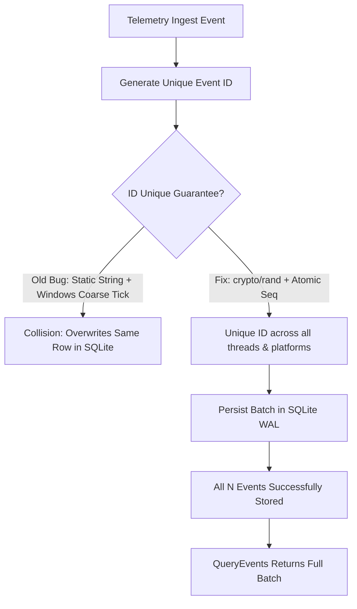

---

**Session type**: T2 (execution)
title: "Plan: Windows Native Cross-Platform Stabilization & Issue #342 Closure"
status: completed
date: "2026-09-25"
issues: ["#342", "#336"]
tags: [windows, cross-platform, telemetry, sqlite, xplat, debt-zero]
blockedBy: []
blocks: []
---

# Plan: Windows Native Cross-Platform Stabilization & Issue #342 Closure

## Context & Objectives

1. **Issue #342 (Bug & Debt)**:
   - **Symptom**: `TestTelemetryEngine_IngestEventsBatch` persists only 1 of N events on Windows runners. Skipped on Windows with `t.Skip` to keep CI green.
   - **Root Cause (Verified on Windows native)**:
     - `randomString(n)` in `internal/telemetry/engine.go` deterministically produced `"abcdefgh"` because of a static index bug: `b[i] = letters[i%len(letters)]` without any random source.
     - On Windows, system clock resolution (`time.Now().UnixNano()`) is millisecond-coarse (~15.6ms), so in tight loops multiple events share the exact same timestamp.
     - The combination produced identical `event.ID` values (`evt-<same_ts>-abcdefgh`).
     - SQLite `INSERT INTO telemetry_events ... ON CONFLICT(id) DO UPDATE` repeatedly updated the same row, leaving only 1 record in the database.
   - **Objective**: Fix `randomString` with `crypto/rand` + atomic sequential counter fallback for collision-proof IDs; unskip `TestTelemetryEngine_IngestEventsBatch` and verify green on Windows native.

2. **Cross-Platform Test Rigidity on Windows (Discovered during full Windows native run)**:
   - `cmd/g8s/main_test.go` (`TestSubmitAndWorkerE2E`): Hardcodes `"args": ["sh", "-c", ...]` in test mock providers.json. On Windows, `sh` does not exist, causing worker execution to fail with exit status 1.
   - `internal/service/service_test.go` (`TestExecRunnerTimeoutFailsClosed`): Spawns `"sleep"`, which does not exist on Windows.
   - `internal/orchestrator/agy_worker_test.go` & `mount_test.go`: Use POSIX utilities (`"true"`, `"false"`, `"sleep"`, `"sh"`) as worker mock commands.

3. **Issue #336 (Audit & Hardening)**:
   - Worktree pool documentation claim vs reality: Align `internal/orchestrator/worktree.go` comments with the actual mutex implementation.
   - DB URI escaping review on Windows.

---

## State & Flow

---

## Implementation Steps

### Phase 1: Fix Issue #342 in `internal/telemetry`
- [x] Unskip `TestTelemetryEngine_IngestEventsBatch` in `internal/telemetry/engine_test.go` (reproduced failure).
- [x] In `internal/telemetry/engine.go`:
  - Update `randomString(n int)` to use `crypto/rand.Read` with error fallback to high-entropy pseudo-random / timestamp mixing.
  - Add atomic sequence counter to `TelemetryEngine` to guarantee monotonic uniqueness for IDs even under identical timestamps.
- [x] Add explicit unit test `TestTelemetryEngine_RapidEventIDUniqueness` verifying that 100 rapid event IDs generated in a tight loop on Windows are 100% unique.
- [x] Verify `go test -v ./internal/telemetry/...` passes on Windows.

### Phase 2: Fix Windows Cross-Platform Fixtures in Tests
- [x] In `cmd/g8s/main_test.go`:
  - Update `TestSubmitAndWorkerE2E` to select PowerShell `Write-Output` on Windows (avoiding cmd.exe quote escaping), and `sh -c` on POSIX.
  - Verify `TestSubmitAndWorkerE2E` passes.
- [x] In `internal/service/service_test.go`:
  - Support Windows timeout fixture in `TestExecRunnerTimeoutFailsClosed` (use PowerShell `Start-Sleep -Seconds 5`).
- [x] In `internal/orchestrator/agy_worker_test.go` & `mount_test.go`:
  - Add `requireCommand` guard helper for external POSIX binaries (`true`, `false`, `sleep`, `sh`).

### Phase 3: Audit & Address Issue #336
- [x] In `internal/orchestrator/worktree.go`:
  - Correct comment on lines 18-20 regarding in-process mutex synchronization.

### Phase 4: Verification & Code Review (`ck:code-review`)
- [x] Run full test suite on Windows: `go test ./...`.
- [x] Run `go vet ./...` on Windows.
- [x] Red-team review of changes.

### Phase 5: Commit & PR
- [x] Create branch `fix/windows-xplat-telemetry-closure`.
- [x] Commit with conventional message linking #342 & #336.
- [x] Push to `origin` and open PR.
