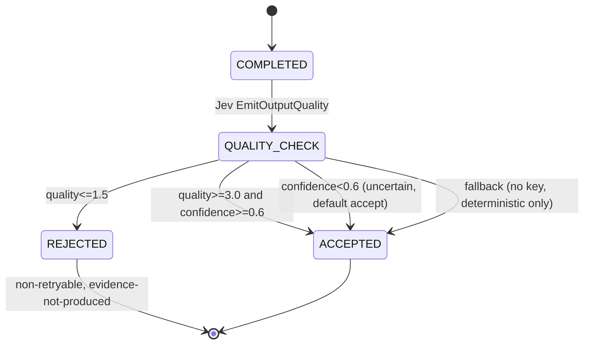

---

**Session type**: T2 (execution)
title: "Plan: L3 Post-run Jev Output Quality Gate"
tags: [reflex, jev, post-run, hallucination, distributed-reflex]
status: planned
issues: [#253, #371]
adr: [docs/decisions/0020-reflex-gated-debt-campaign.md, docs/decisions/0021-standard-operating-model.md]
blockedBy: []
blocks: []
---

# Plan: L3 Post-run Jev Output Quality Gate

ALDC Stage 2 (Plan) — the third deployment point in the distributed reflex
architecture (L1 pre-dispatch shipped #366; L6 PR triage shipped #372; L3
post-run is the highest-impact remaining point because it blocks
hallucination at the source before it poisons the control plane).

## Problem

Worker completes → result says "succeeded" → but output is hallucinated
(garbage code, fabricated analysis, non-evidence). The deterministic
`validateResult` catches structural issues (missing fields, wrong types) but
cannot assess SEMANTIC quality. #373 proved this: `token=False` was corrupted
by sanitization, the output passed structural validation, but was invalid.

## State Diagram

## Red Test Proof

1. **RED**: a worker returns "COMPLETED: task done" with 5000 chars of
   incoherent text — current `validateResult` passes it (structural check
   only). Expected: Jev output-quality gate rejects it.
2. **GREEN**: hook fires after `readWorkerResult` → Jev assesses →
   quality score ≤ 1.5 → result classified as `blocked` (non-retryable,
   "output failed quality assessment").
3. **Fallback**: `G8S_TELEMETRY` not set or no Jev key → hook skipped,
   existing deterministic validation only (no behavior change).

## Implementation

| File | Change |
|------|--------|
| `internal/reflex/jev.go` | Add `EmitOutputQualitySignal(ctx, OutputQualityRequest) (ReflexSignal, error)` |
| `internal/worker/worker.go` | Add `outputQualityGate()` in `collect()` default case, after `readWorkerResult`, before `validateResult` |
| `internal/worker/worker_test.go` | Mock Jev + integration test |

## Non-goals

- L4 skill routing, L5 F1→F2 gate, L7 escalation context — separate slices
- Real-time streaming quality check (post-run only for now)
- Deterministic-only mode (no Jev) — same as L1, fallback to existing validation

## Tasks

| # | Task | Verification |
|---|------|-------------|
| 1 | `OutputQualityRequest` type + Jev questions | compile |
| 2 | `EmitOutputQualitySignal` on ReflexGate | unit test with httptest mock |
| 3 | Worker hook: gate in `collect()` default case | integration test: hallucinated output → blocked |
| 4 | Env opt-in: `G8S_TELEMETRY=1` (same as ingestion) | test disabled → no hook fired |
