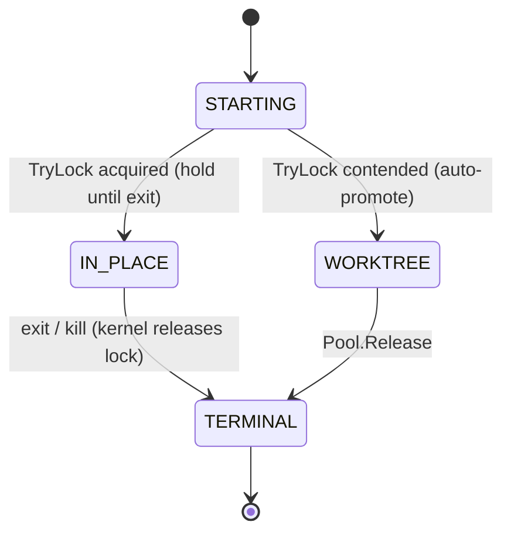

# Plan: S1 — Session-Scoped State (flock-gated isolation + registry + provenance)

**Session type**: T2 (execution)

```yaml
issue: 393
session_type: T2 (execution)
slice: S1 (P0, next-campaign first slice)
ratified_by: operator, 2026-09-26 (plans/260926-strategy-t1-session/plan.md)
adr: docs/decisions/0022-strategic-session-protocol.md (Accepted)
precondition: R6 (user_version receipt v3 vs controlplane v10) resolved in its own small PR BEFORE Phase 1
```

## Objective

Two or more concurrent supervisor/orchestrate sessions in one clone can no
longer corrupt each other's git refs or state (D6 class killed at the root):
contention auto-promotes the second session into an isolated worktree, every
shared DB write carries a provenance stamp, and cleanup can identify and reap
dead sessions without touching live ones.

## Scope / Non-goals

**In scope**: file-lock gate (`flock`/`LockFileEx`), sessions registry table,
`session_id` columns + composite indexes on tasks/receipts/telemetry,
provenance stamps on shared writes, cleanup integration (dead-session reap),
worktree auto-promotion on contention.

**Non-goals**: `--concurrency` flag (S2, #394 — hard-coupled to land after
this); memory promotion gate (S3a, #395); Context Broker (#396); multi-tenant
RBAC or live cross-session FSM sync (README Non-Goals).

## Architecture notes

- **Lock primitive is new ground**: no `syscall.Flock` / `LockFileEx` exists in
  the codebase today (scout, grep verified). New tiny package
  `internal/lockfile`: `TryLock(path) (handle, error)` non-blocking — Unix
  `syscall.Flock` (LOCK_EX|LOCK_NB), Windows `LockFileEx` — both pure-Go,
  Zero-CGO (Constitution Axiom 3). Kernel releases the lock on process death:
  crash-safe by construction, no stale-lock reaping.
- **Lock location**: `.g8s/session.lock` beside the state DB (`g8s.db` path
  resolution reused). Permissions 0600/0700 (Axiom 4).
- **Worktree Pool already exists** (`internal/orchestrator/worktree.go`:
  `NewPool/Acquire/Release`) — promotion reuses it; no new worktree machinery.
- **DB**: `receipts.db` is already a sibling of `g8s.db` (lifecycle.go:63) —
  session columns go into BOTH files' relevant tables; R6 precondition governs
  the user_version handling per file.
- **Registry truth**: `sessions` table (id, started_at, heartbeat_at, status,
  mode[in_place|worktree], worktree_path). `session_id` alone cannot
  distinguish live from zombie — status + heartbeat is the cleanup contract.

## Implementation phases

- **Phase 1 — Schema**: `sessions` registry table + `session_id` columns on
  tasks/task_events/write_receipts/telemetry tables + composite index
  `(session_id, status)` + partial index `WHERE is_active = 1` only (SQLite
  partial indexes need literals — per-session partial index is impossible).
  Idempotent migration via the existing ALTER TABLE ADD COLUMN path
  (store.go:422).
- **Phase 2 — Provenance stamps**: every shared write (task submit, receipt
  issue/consume, telemetry ingest) stamps `session_id` + source task where
  applicable. Additive columns; old readers ignore them.
- **Phase 3 — Registry lifecycle**: register session on orchestrate/supervisor
  start, heartbeat during RunLoop ticks, mark dead on graceful exit; stale
  detection = heartbeat timeout (configurable, default 5× tick).
- **Phase 4 — Lock gate**: `internal/lockfile` + wiring at the
  orchestrate/supervisor entry: `TryLock` acquired → run in-place holding the
  handle; `EWOULDBLOCK` → auto-promote: `Pool.Acquire(sessionID)` and run
  inside the worktree; emit `session_promoted` telemetry event in both paths.
- **Phase 5 — Cleanup integration**: `g8s cleanup` reaps dead-session rows
  (registry status=dead past grace period) and orphans their worktrees;
  `status --worker` surfaces per-session mode + lock state.

## State Diagram



Registry parallel: `active → (heartbeat timeout | graceful exit) → dead → reaped`.

## Red Test Proof

- **RED**: `CGO_ENABLED=0 go test ./internal/controlplane/ -run TestConcurrentSessionPromotion -count=1` →
  must FAIL (exit 1) before Phase 4 (no promotion path exists).
- **Substance**: the test materializes a temp clone, starts two Supervisor
  sessions against it, and asserts: (a) first session runs in-place, (b)
  second session's refs live in a pool worktree, (c) zero ref movement in the
  first session's namespace, (d) kill -9 on the first frees the lock for the
  next session (kernel-release property).
- **GREEN**: same command passes after Phase 4; `go test -race` variant green
  after Phase 5.

## Testing / validation plan

- Dual-pass mandatory: `CGO_ENABLED=0 go vet ./... && go test -count=1 ./...`
  + `CGO_ENABLED=1 go test -race -count=1 ./...`.
- Flock contention tests (parallel goroutines, real temp clone).
- Migration idempotency: open DB twice, assert no error + columns present.
- Cleanup reap test: dead session rows reaped, live untouched.
- Cross-platform build gate: windows/amd64 compile of `internal/lockfile`
  (LockFileEx path) — covered by the existing cross-platform pre-push gate.

## Security / privacy notes

- Lock file and registry rows carry no secrets; prompts stay hashed (Axiom 4).
- Provenance stamps are the undo path for a compromised session (bulk-revoke
  by session_id) — the security property that makes sharing safe.

## Migration / backward compatibility

- All schema changes additive (new table, new columns, new indexes) — old
  binaries keep working; no backfill needed (pre-existing rows get NULL
  session_id = "legacy, always reapable by existing rules").
- Rollback/abort: remove the gate wiring (Phase 4) — everything else is inert
  metadata. Abort criteria: flock misbehaves on a supported filesystem
  (verified in contention tests) → gate off by env flag, file issue.

## Unresolved questions

- None blocking — design ratified. R6 PR timing is the only external
  dependency (owned separately, small).
