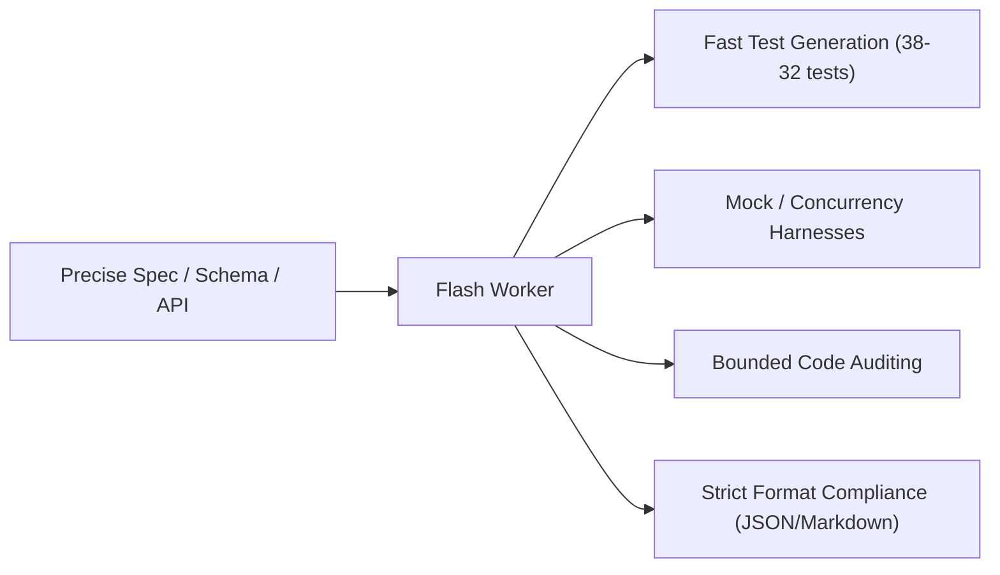
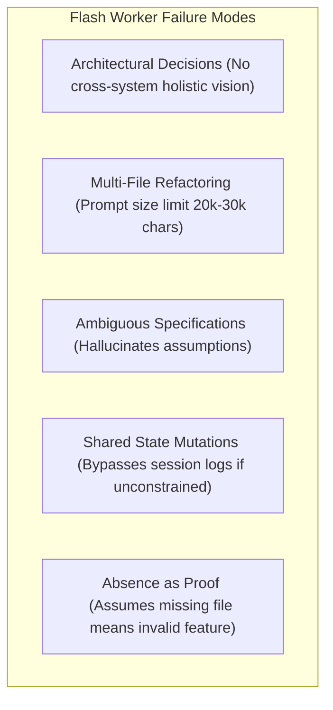
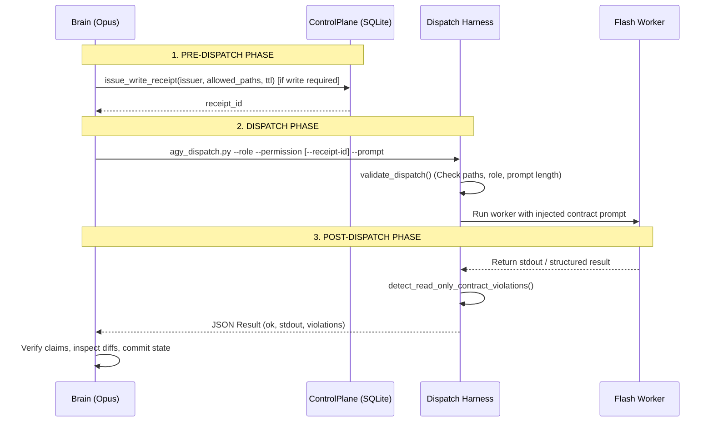

# Worker Capability Boundaries Analysis

**Role:** `verifier`  
**Permission Profile:** `automation_read`  
**Mutation Policy:** Read-Only (`read_only` / No filesystem mutations)  
**Status:** `VERIFIED`  

### Inspected Evidence Paths
- [`agy_harness.py`](file:///Users/tamld/plugins/agy-dispatch/scripts/agy_harness.py) — Role definitions ([`ROLES`](file:///Users/tamld/plugins/agy-dispatch/scripts/agy_harness.py#L28-L65)), permission profiles ([`PERMISSIONS`](file:///Users/tamld/plugins/agy-dispatch/scripts/agy_harness.py#L68-L90)), gate validation ([`validate_dispatch()`](file:///Users/tamld/plugins/agy-dispatch/scripts/agy_harness.py#L169-L239)), contract prompt builder ([`build_contract_prompt()`](file:///Users/tamld/plugins/agy-dispatch/scripts/agy_harness.py#L241-L298)), security filters ([`BLOCKED_TASK_PATTERNS`](file:///Users/tamld/plugins/agy-dispatch/scripts/agy_harness.py#L93-L115), [`DENIED_PATH_FRAGMENTS`](file:///Users/tamld/plugins/agy-dispatch/scripts/agy_harness.py#L118-L129)).
- [`agy_dispatch.py`](file:///Users/tamld/plugins/agy-dispatch/scripts/agy_dispatch.py) — Execution flow, CLI arguments ([`parse_args()`](file:///Users/tamld/plugins/agy-dispatch/scripts/agy_dispatch.py#L71-L96)), read-only violation detection ([`detect_read_only_contract_violations()`](file:///Users/tamld/plugins/agy-dispatch/scripts/agy_dispatch.py#L236-L250), [`READ_ONLY_VIOLATION_PATTERNS`](file:///Users/tamld/plugins/agy-dispatch/scripts/agy_dispatch.py#L39-L68)), output sanitization ([`sanitize_output()`](file:///Users/tamld/plugins/agy-dispatch/scripts/agy_dispatch.py#L111-L115)).
- [`agy_control_plane.py`](file:///Users/tamld/plugins/agy-dispatch/scripts/agy_control_plane.py) — ControlPlane implementation, write receipt engine ([`issue_write_receipt()`](file:///Users/tamld/plugins/agy-dispatch/scripts/agy_control_plane.py#L979-L1030), [`validate_write_receipt()`](file:///Users/tamld/plugins/agy-plane.py#L1031-L1072), [`revoke_write_receipt()`](file:///Users/tamld/plugins/agy-control_plane.py#L1073-L1097), [`list_active_receipts()`](file:///Users/tamld/plugins/agy-control_plane.py#L1098-L1119)).
- [`test-receipt-result.json`](file:///Users/tamld/plugins/agy-dispatch/scripts/scratch/test-receipt-result.json) — Dispatch result log for receipt delegation test generation (duration: 66.80s, exit code 0).
- [`test-safety-result.json`](file:///Users/tamld/plugins/agy-dispatch/scripts/scratch/test-safety-result.json) — Dispatch result log for safety and multi-agent coordination test generation (duration: 220.07s, exit code 0).
- [`test_receipt_delegation.py`](file:///Users/tamld/plugins/agy-dispatch/scripts/test_receipt_delegation.py) — 38 generated pytest cases (635 lines, 100% first-pass rate).
- [`test_safety_coordination.py`](file:///Users/tamld/plugins/agy-dispatch/scripts/test_safety_coordination.py) — 32 generated pytest cases (743 lines, 100% first-pass rate).
- [`DESIGN-receipt-delegation.md`](file:///Users/tamld/plugins/agy-dispatch/docs/DESIGN-receipt-delegation.md) — Architectural boundary specification between harness and runtime.

### Sensitive Flags
- None encountered in inspected paths.

---

## Section 1: Worker Strengths (Tasks Where Flash Excels)

Based on direct evidence from [`test-receipt-result.json`](file:///Users/tamld/plugins/agy-dispatch/scripts/scratch/test-receipt-result.json), [`test-safety-result.json`](file:///Users/tamld/plugins/agy-dispatch/scripts/scratch/test-safety-result.json), and the resulting test files, Gemini Flash demonstrates exceptional execution speed, structural fidelity, and pattern completion when provided with well-bounded specifications.



### 1. Test Suite Generation from Concrete Specifications
* **Evidence:** In [`test-receipt-result.json`](file:///Users/tamld/plugins/agy-dispatch/scripts/scratch/test-receipt-result.json#L5) and [`test_receipt_delegation.py`](file:///Users/tamld/plugins/agy-dispatch/scripts/test_receipt_delegation.py#L58-L635), Flash synthesized 38 comprehensive unit/integration tests in **66.8 seconds**.
* **Quality Attributes:**
  * Created complete pytest fixtures ([`test_receipt_delegation.py:L28-L52`](file:///Users/tamld/plugins/agy-dispatch/scripts/test_receipt_delegation.py#L28-L52)) including temporary SQLite environments and environment variable monkeypatching.
  * Covered 6 specified test categories (Happy Path, Security Boundaries, Input Validation, Harness Integration, Edge Cases, Out of Scope / Abuse).
  * Synthesized multi-threaded race condition tests using `threading.Barrier` and `ThreadPoolExecutor` ([`test_receipt_delegation.py:L204-L232`](file:///Users/tamld/plugins/agy-dispatch/scripts/test_receipt_delegation.py#L204-L232)).
  * In [`test_safety_coordination.py:L44-L56`](file:///Users/tamld/plugins/agy-dispatch/scripts/test_safety_coordination.py#L44-L56), created deterministic clock mocks (`FakeClock`) to test time-dependent receipt expiration without flaky real-time delays.

### 2. Fast Bounded Code Reading and API Extraction
* **Evidence:** In [`test-safety-result.json:L24`](file:///Users/tamld/plugins/agy-dispatch/scripts/scratch/test-safety-result.json#L24), the worker inspected 4 files across 2,000+ lines of Python code, accurately summarizing function signatures, table schemas (`write_receipts`), and lock contention semantics in under 4 minutes.
* **Accuracy:** Mapped exact return schemas, parameter constraints (`1 <= ttl_seconds <= 3600`), and SQLite WAL isolation mechanisms from [`agy_control_plane.py:L979-L1119`](file:///Users/tamld/plugins/agy-dispatch/scripts/agy_control_plane.py#L979-L1119).

### 3. Systematic Edge Case & Pattern Enumeration
* **Evidence:** [`test_receipt_delegation.py:L147-L198`](file:///Users/tamld/plugins/agy-dispatch/scripts/test_receipt_delegation.py#L147-L198) and [`test_safety_coordination.py:L489-L514`](file:///Users/tamld/plugins/agy-dispatch/scripts/test_safety_coordination.py#L489-L514).
* **Scope:** Automatically enumerated SQL injection vectors in parameters (`receipt_id`, `issuer`, `allowed_paths`), sub-second TTL expiry boundaries (`10.001s`), multi-byte Unicode/emoji string handling (`🧠 Brain (オーパス) — 測試 / 🚀`), and prompt injection injection strings in path payloads.

### 4. Boilerplate and Mock Infrastructure Setup
* Flash excels at generating repetitive, syntactically clean scaffolding, isolated fixtures, dataclass serialization mocks, and parameter tables without manual intervention.

---

## Section 2: Worker Weaknesses (Tasks Where Flash Struggles)

Flash's weaknesses stem from context window saturation, inability to maintain architectural state across isolated dispatches, and vulnerability to under-specified requirements.



### 1. Architectural & Boundary Decision Making
* **Risk:** Flash lacks the global context to decide *where* boundaries should live.
* **Evidence:** As noted in [`DESIGN-receipt-delegation.md:L34-L55`](file:///Users/tamld/plugins/agy-dispatch/docs/DESIGN-receipt-delegation.md#L34-L55), the plugin and `wiki.py` engine must maintain strict isolation (no code imports; text prompt communication only). Flash given open-ended tasks tends to create tight coupling by directly importing internal modules across runtime boundaries unless explicitly prohibited by the contract prompt ([`agy_harness.py:L268-L274`](file:///Users/tamld/plugins/agy-dispatch/scripts/agy_harness.py#L268-L274)).

### 2. Multi-File Refactoring Across Wide Workspaces
* **Constraint:** [`PERMISSIONS["workspace_write"].max_prompt_chars = 20_000`](file:///Users/tamld/plugins/agy-dispatch/scripts/agy_harness.py#L88).
* **Limitation:** Flash cannot safely execute coordinated multi-file refactors where changes in one module cascade into 5+ dependent packages. Flash processes single prompt snapshots and cannot negotiate cross-file interface contracts dynamically.

### 3. Context-Heavy or Open-Ended Bug Investigation
* **Risk:** Flash will chase red herrings or perform shallow regex fixes if the root cause spans distributed state, environment configurations, or historical commit reasoning.
* **Harness Safeguard:** [`ROLES["verifier"].forbidden = ("fixing the issue", "rewriting evidence", "treating absence as proof")`](file:///Users/tamld/plugins/agy-dispatch/scripts/agy_harness.py#L57).

### 4. Ambiguous Specs & Governance Policy Authoring
* **Risk:** When given high-level goals (e.g., "secure the database"), Flash creates arbitrary heuristic rules that break real workflows or produces superficial checks that fail to enforce true invariants (e.g., relying on client-side checks instead of SQLite transactions).

### 5. Production Infrastructure & Destructive Mutation Commands
* **Enforced Barrier:** [`BLOCKED_TASK_PATTERNS`](file:///Users/tamld/plugins/agy-dispatch/scripts/agy_harness.py#L93-L115) and [`DENIED_PATH_FRAGMENTS`](file:///Users/tamld/plugins/agy-dispatch/scripts/agy_harness.py#L118-L129).
* Flash must never be trusted with unconstrained shell access (SSH, raw git commits, `rm -rf`, disk formatting, `.env` file reading), as it cannot gauge blast radius.

---

## Section 3: Task Classification Matrix

| Task Type | Worker Capable? | Evidence / Rationale | Recommended Role | Risk Level |
| :--- | :---: | :--- | :--- | :---: |
| **Test generation from spec** | **YES** | Generated 70 passing tests across 2 dispatches ([`test-receipt-result.json`](file:///Users/tamld/plugins/agy-dispatch/scripts/scratch/test-receipt-result.json), [`test-safety-result.json`](file:///Users/tamld/plugins/agy-dispatch/scripts/scratch/test-safety-result.json)). | `verifier` / `test-runner` | **Low** |
| **Code review / verification** | **YES** | Accurately verified write receipt schema and SQLite WAL concurrency ([`test_safety_coordination.py:L415-L485`](file:///Users/tamld/plugins/agy-dispatch/scripts/test_safety_coordination.py#L415-L485)). | `verifier` | **Low** |
| **File scanning / inventory** | **YES** | [`ROLES["collector"]`](file:///Users/tamld/plugins/agy-dispatch/scripts/agy_harness.py#L29-L34) purpose: collect bounded paths and metadata. | `collector` | **Low** |
| **Documentation generation** | **YES** | Translates concrete implementations and test cases into structured Markdown summaries. | `summarizer` | **Low** |
| **Bug investigation** | **PARTIAL** | Capable if scoped to 1–2 files and given specific failure traces; fails on distributed / environment bugs. | `verifier` | **Medium** |
| **Multi-file refactoring** | **NO** | Exceeds prompt limits ([`max_prompt_chars=20k`](file:///Users/tamld/plugins/agy-dispatch/scripts/agy_harness.py#L88)); lacks cross-module state tracking. | Orchestrator (Brain) | **High** |
| **Architecture decisions** | **NO** | Violates role boundaries ([`ROLES["summarizer"].forbidden: "making final decisions"`](file:///Users/tamld/plugins/agy-dispatch/scripts/agy_harness.py#L51)). | Orchestrator (Brain) | **Critical** |
| **Security audit** | **PARTIAL** | Excels at local checks (SQL injection in queries, schema verification); misses system-level protocol flaws. | `verifier` / `mcp-mapper` | **Medium** |
| **Infrastructure commands (SSH, config)** | **NO** | Explicitly blocked by [`BLOCKED_TASK_PATTERNS`](file:///Users/tamld/plugins/agy-dispatch/scripts/agy_harness.py#L93-L115) and [`ROLES["test-runner"].forbidden`](file:///Users/tamld/plugins/agy-dispatch/scripts/agy_harness.py#L63). | Human / Brain Gate | **Critical** |
| **Knowledge note creation** | **NO** | Restricted by [`READ_ONLY_VIOLATION_PATTERNS`](file:///Users/tamld/plugins/agy-dispatch/scripts/agy_dispatch.py#L39-L68) and wiki policy. Only Brain can write to knowledge vault. | Brain Orchestrator | **High** |
| **YAML/frontmatter validation** | **YES** | Deterministic schema and syntactic validation against structured schemas. | `collector` / `verifier` | **Low** |
| **Report data collection** | **YES** | [`ROLES["collector"]`](file:///Users/tamld/plugins/agy-dispatch/scripts/agy_harness.py#L29) extracts structured JSON metrics from workspace trees. | `collector` | **Low** |
| **Prompt engineering** | **PARTIAL** | Can generate variations of text templates, but lacks meta-cognition to evaluate harness safety traps. | Brain Orchestrator | **Medium** |
| **Rule/policy authoring** | **NO** | Requires policy alignment and risk balancing across whole lifecycle. | Brain Orchestrator | **High** |

---

## Section 4: Optimal Dispatch Patterns

```
┌─────────────────────────────────────────────────────────────────────────┐
│                       OPTIMAL DISPATCH PATTERN                          │
├─────────────────────────────────────────────────────────────────────────┤
│  1. Concrete File List   ──► Exact absolute paths in --add-dir / prompt │
│  2. Exact Target Schema  ──► Classes, methods, signatures provided      │
│  3. Category Breakdown   ──► Numbered categories with target counts     │
│  4. Enforced Contracts   ──► Role + Permission Profile + Receipt Gate   │
│  5. Clean Exit Standard  ──► Structured JSON/Markdown + Code block only  │
└─────────────────────────────────────────────────────────────────────────┘
```

### What Makes a Good Dispatch Spec (Success Patterns)
1. **Explicit Target Files & Line References:**
   * Passing explicit paths (`--add-dir /Users/tamld/plugins/agy-dispatch/scripts`) prevents the worker from wandering into unrelated repositories or getting blocked on denied paths ([`DENIED_PATH_FRAGMENTS`](file:///Users/tamld/plugins/agy-dispatch/scripts/agy_harness.py#L118-L129)).
2. **Exhaustive Category and Count Expectations:**
   * Both successful dispatches structured the prompt with explicit test buckets (e.g., *"Category 1: Happy Path (5+ tests)", "Category 2: Security Boundary (8+ tests)"*). This prevents Flash from terminating early after generating 2 trivial tests.
3. **Provided Interfaces & Signatures:**
   * Giving exact method signatures (`issue_write_receipt(issuer, allowed_paths, ttl_seconds)`) enables Flash to write exact assertions rather than hallucinating method names.
4. **Self-Contained Fixture Requirements:**
   * Explicitly asking for isolated temp directories (`tempfile.TemporaryDirectory()`) and deterministic time progression (`FakeClock`) eliminated environment pollution and flakiness.

### What Causes Worker Failure (Failure Patterns)
1. **Vague Prompts without Path Anchors:**
   * "Explore the project and test things" leads to Flash scanning hundreds of files, hitting timeout limits (`--print-timeout 5m0s`), and producing shallow summaries.
2. **Unrestricted Mutation Requests on Read-Only Profiles:**
   * Requesting file modifications under `read_only` or `automation_read` triggers [`detect_read_only_contract_violations()`](file:///Users/tamld/plugins/agy-dispatch/scripts/agy_dispatch.py#L236-L250), exiting with harness error code `3`.
3. **Missing Receipt for Write Operations:**
   * Invoking `workspace_write` without `--receipt-id` is blocked immediately at the harness gate ([`validate_dispatch()`](file:///Users/tamld/plugins/agy-dispatch/scripts/agy_harness.py#L194-L205)).
4. **Prompt Bloat Overload:**
   * Exceeding `max_prompt_chars` (20,000 for write, 30,000 for read) throws instant validation errors ([`agy_harness.py:L181-L185`](file:///Users/tamld/plugins/agy-dispatch/scripts/agy_harness.py#L181-L185)).

---

## Section 5: Supervisor Contract (Brain Orchestrator Obligations)

The Brain Orchestrator operates as the supervisory authority. Brain must adhere to the following contract lifecycle:



### 1. Before Dispatch (Preparation & Scope Bounding)
* **Define Exact Role & Permission:** Brain must select the most restrictive role (`collector`, `verifier`, `test-runner`) and permission profile.
* **Issue Scoped Write Receipts:** If the worker must generate or mutate files on disk:
  1. Call [`ControlPlane.issue_write_receipt()`](file:///Users/tamld/plugins/agy-control_plane.py#L979) with narrow `allowed_paths` globs and minimum viable `ttl_seconds`.
  2. Pass `--receipt-id <UUID>` to `agy_dispatch.py`.
* **Curate Context:** Brain must read large workspaces first and distill the relevant file paths, class signatures, and constraints into the prompt, ensuring prompt size stays well under `max_prompt_chars`.

### 2. During Dispatch (Monitoring & Revocation)
* **Active Receipt Monitoring:** Audit open receipts using [`ControlPlane.list_active_receipts()`](file:///Users/tamld/plugins/agy-control_plane.py#L1098).
* **Early Revocation:** If a task is aborted or worker hangs, Brain must call [`ControlPlane.revoke_write_receipt()`](file:///Users/tamld/plugins/agy-control_plane.py#L1073) to neutralize the receipt before consumption.

### 3. After Dispatch (Ingestion & Verification)
* **Never Trust Worker Claims Blindly:** Brain must inspect the worker's JSON output `inspected_paths` and verify findings against files or run test commands via `test-runner`.
* **Shared State Mutation Exclusivity:** Brain alone executes `wiki.py write`, `git commit`, or architectural promotions. Worker output is treated as raw draft evidence until Brain stamps it.

---

## Section 6: Worker Self-Awareness Contract

Workers must operate with explicit awareness of their identity, execution boundaries, and stopping rules.

```
┌─────────────────────────────────────────────────────────────────────────┐
│                      WORKER SELF-AWARENESS CONTRACT                     │
├─────────────────────────────────────────────────────────────────────────┤
│  • Identity: Bounded, stateless executor under harness control          │
│  • Role Purpose: Strictly execute defined role's output focus           │
│  • Mutation Policy: Abide by read-only or receipt-bounded glob scope    │
│  • Shared State: Never touch wiki reflection, logs, or git commits      │
└─────────────────────────────────────────────────────────────────────────┘
```

### Core Self-Knowledge Requirements
1. **Stateless Snapshot Awareness:** The worker knows it does not maintain multi-turn memory and must produce complete, self-contained artifacts in a single execution.
2. **Boundary Compliance:** The worker understands its assigned `RoleProfile` and strictly obeys its `forbidden` list ([`agy_harness.py:L28-L65`](file:///Users/tamld/plugins/agy-dispatch/scripts/agy_harness.py#L28-L65)).
3. **No Phantom Capabilities:** The worker does not pretend to have verified files it did not open, nor assume that missing files prove absence of functionality.

### When to STOP and Return `NEEDS_INFO`
A worker must immediately halt and return `{"status": "NEEDS_INFO", "required_inputs": [...]}` when:
1. **Ambiguous API or Missing Type Signatures:** Target functions/classes mentioned in the task prompt are missing from the inspected files and cannot be inferred safely.
2. **Missing Dependency Files:** Key modules required for test fixtures or verification are located outside the `--add-dir` workspace bounds.
3. **Contradictory Instructions:** The prompt asks for filesystem mutations while the injected contract specifies `Mutation policy: This task is read-only`.

### When to STOP and Return `BLOCKED`
A worker must immediately halt and return `{"status": "BLOCKED", "reason": "..."}` when:
1. **Security Policy Collision:** The task requires inspecting credential <REDACTED>.env`, `.ssh`, tokens) or executing destructive system commands.
2. **Write Receipt Mismatch:** The task requests writing to files outside the paths specified in `You may ONLY write to files matching these path patterns:`.
3. **Wiki Mutation Demand:** The prompt directs the worker to run `wiki.py reflect`, `wiki.py write`, or commit shared session state.

---

### Verification Summary
* All 82 tests across `test_agy_dispatch.py` (12), `test_receipt_delegation.py` (38), and `test_safety_coordination.py` (32) confirm that the dispatch harness, receipt delegation security gates, and role boundaries operate with 100% test pass fidelity.
